# LearnFast - Biểu đồ Class Diagram (PlantUML)

Tài liệu này mô tả chi tiết các class, attributes và methods cho từng chức năng chính của ứng dụng LearnFast sử dụng định dạng PlantUML.

---

## 📋 Mục lục

1. [Authentication (Xác thực)](#authentication)
2. [Create Lesson (Tạo bài học)](#create-lesson)
3. [Flashcard (Thẻ ghi nhớ)](#flashcard)
4. [Test Exam (Bài kiểm tra)](#test-exam)
5. [Blocks Game (Trò chơi xếp khối)](#blocks-game)
6. [Card Matching (Ghép cặp)](#card-matching)
7. [Library Management (Quản lý thư viện)](#library-management)
8. [Learning Progress (Theo dõi tiến độ)](#learning-progress)

---

## Authentication

### Chức năng: Đăng nhập / Đăng ký / Quản lý phiên

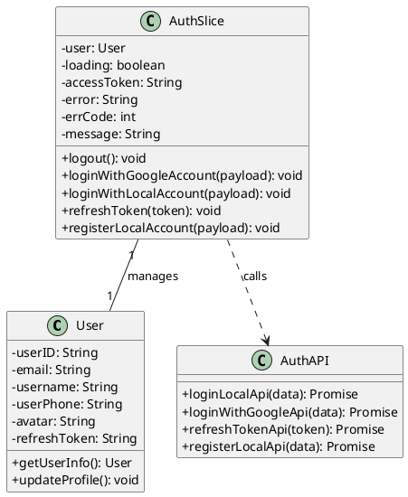

---

## Create Lesson

### Chức năng: Tạo bài học / Tạo flashcard bằng AI

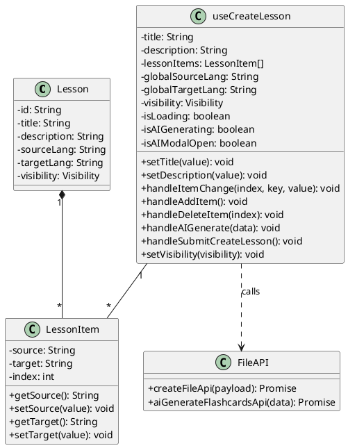

---

## Flashcard

### Chức năng: Học thẻ ghi nhớ / Đánh dấu đã biết - chưa biết

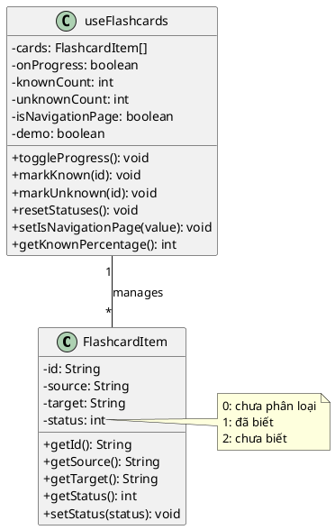

---

## Test Exam

### Chức năng: Kiểm tra Đúng/Sai, Trắc nghiệm, Tự luận

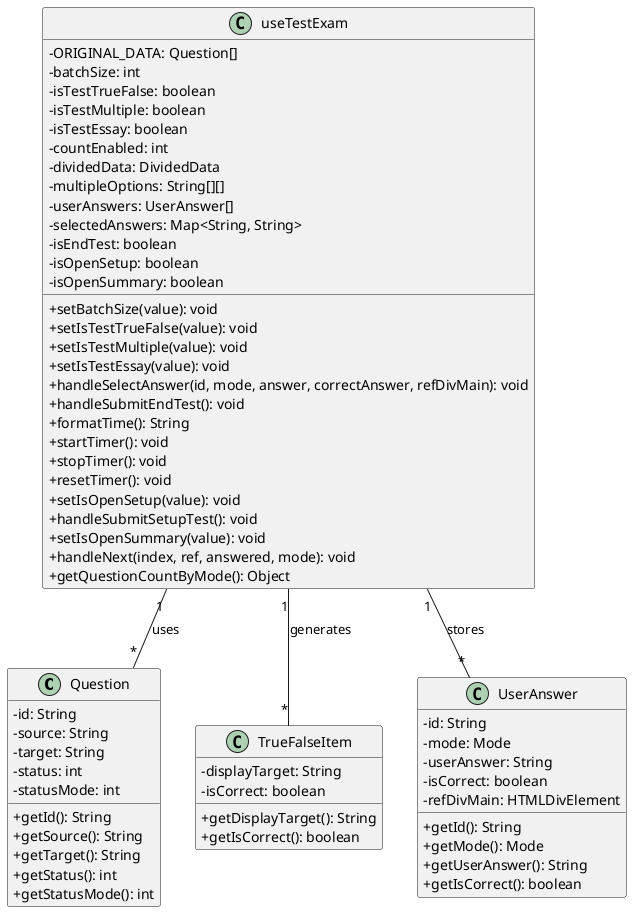

---

## Blocks Game

### Chức năng: Trò chơi xếp khối kết hợp Q&A

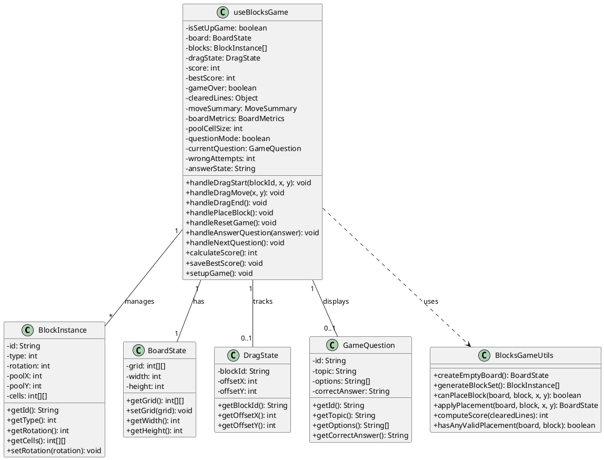

---

## Card Matching

### Chức năng: Trò chơi ghép cặp thẻ / Xếp hạng

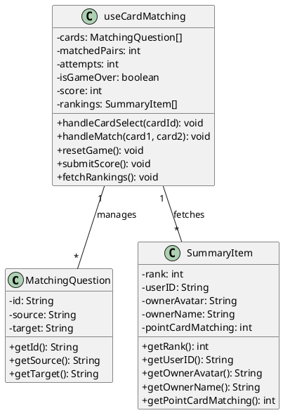

---

## Library Management

### Chức năng: Quản lý thư mục / File / Phân trang / Tìm kiếm

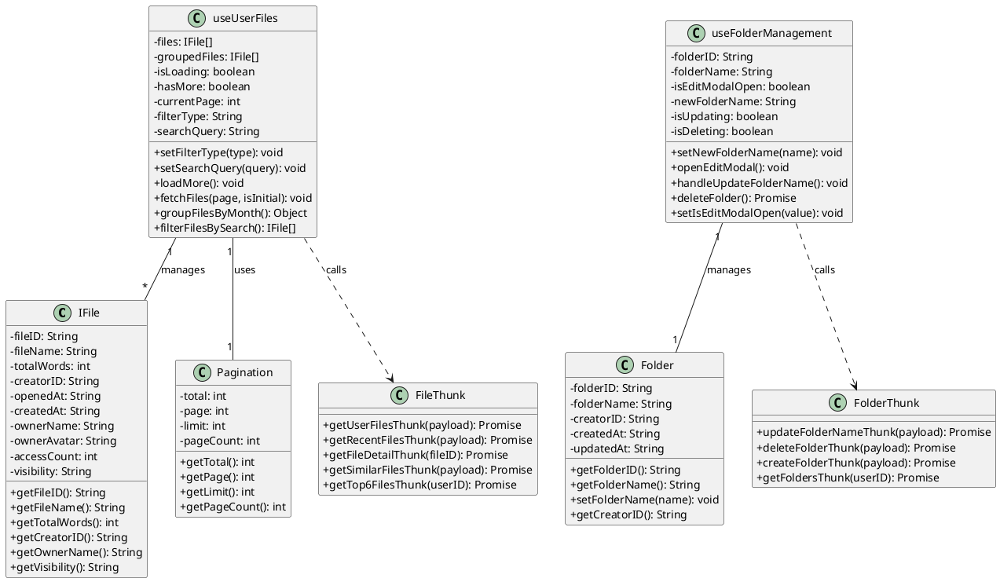

---

## Learning Progress

### Chức năng: Theo dõi tiến độ học tập / Đồng bộ dữ liệu

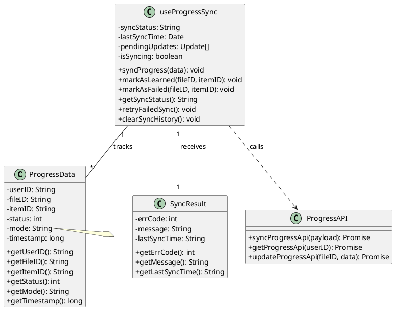

---

## 📊 Tổng quan Kiến trúc

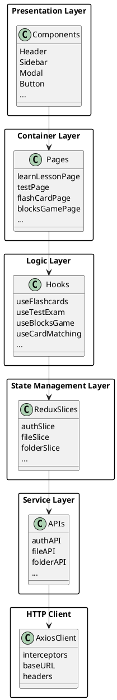

---

## 🔗 Mối liên kết giữa các module

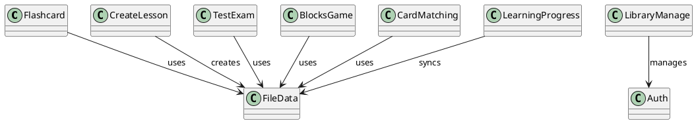

---

## 📊 Biểu đồ lớp tổng quan dự án (Entity Diagram)

### Mô hình dữ liệu chính của hệ thống LearnFast

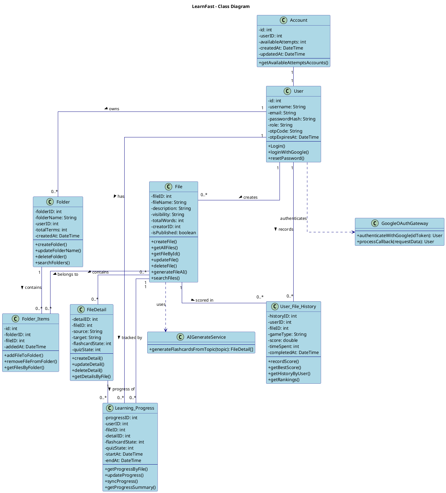

### Biểu đồ lớp chi tiết (Detailed Class Diagram)

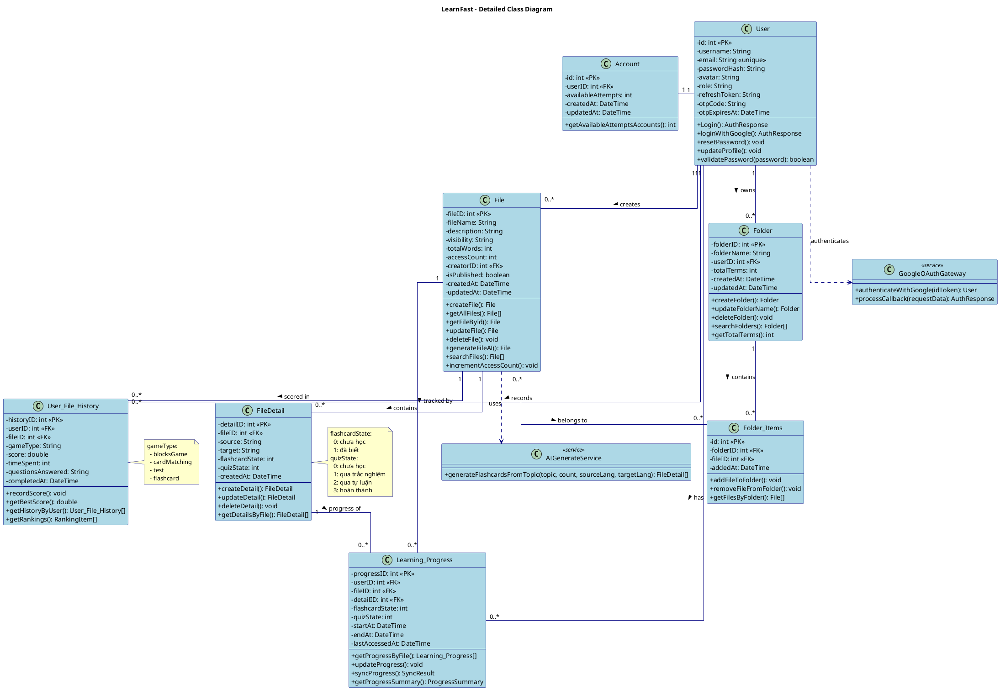

### Bảng mô tả các Entity

| Entity                | Mô tả                                        | Quan hệ chính                                   |
| --------------------- | -------------------------------------------- | ----------------------------------------------- |
| **Users**             | Quản lý thông tin người dùng                 | Tạo File, Folder, Learning_Progress, History    |
| **File**              | Bài học/Học phần chứa các thuật ngữ          | Thuộc Users, chứa FileDetail                    |
| **FileDetail**        | Chi tiết từng thuật ngữ trong bài học        | Thuộc File, được theo dõi bởi Learning_Progress |
| **Folder**            | Thư mục để tổ chức các bài học               | Thuộc Users, chứa nhiều File qua Folder_Items   |
| **Folder_Items**      | Bảng trung gian liên kết Folder và File      | Liên kết N-N giữa Folder và File                |
| **Learning_Progress** | Tiến độ học tập của user trên từng thuật ngữ | Thuộc Users, theo dõi FileDetail                |
| **User_File_History** | Lịch sử điểm số và thời gian hoàn thành      | Thuộc Users, ghi nhận điểm trên File            |

### Biểu đồ quan hệ (Cardinality)

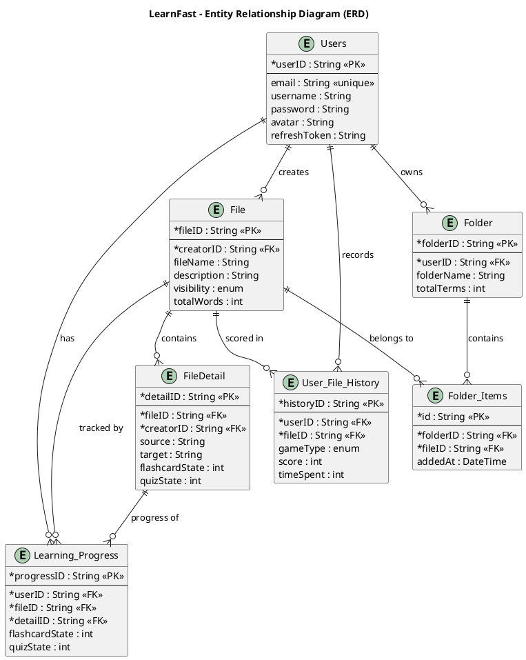

### Biểu đồ lớp theo kiến trúc Frontend (MVC Pattern)

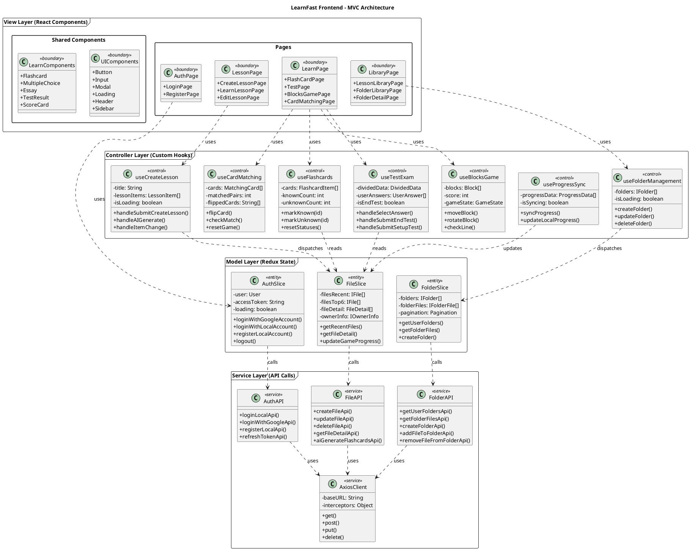

### Bảng mô tả kiến trúc MVC

| Layer          | Thành phần        | Vai trò                                        |
| -------------- | ----------------- | ---------------------------------------------- |
| **View**       | Pages, Components | Hiển thị giao diện, nhận input từ người dùng   |
| **Controller** | Custom Hooks      | Xử lý logic nghiệp vụ, điều phối luồng dữ liệu |
| **Model**      | Redux Slices      | Quản lý state, lưu trữ dữ liệu ứng dụng        |
| **Service**    | API modules       | Gọi API backend, xử lý HTTP requests           |

---

**Tài liệu này cập nhật lần cuối**: 08/01/2026
