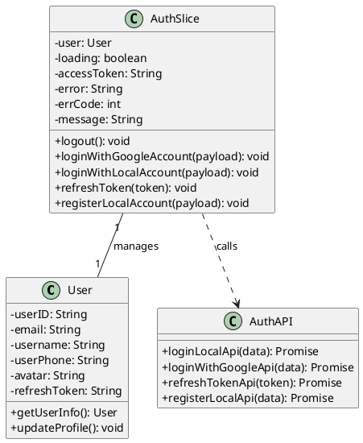
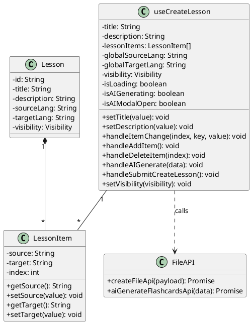
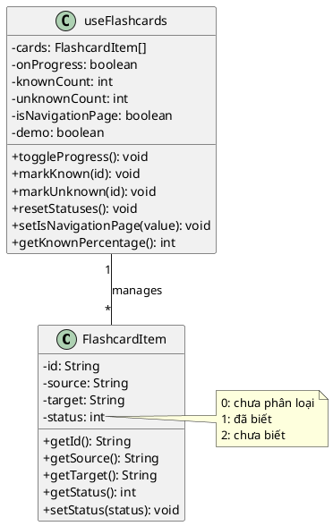
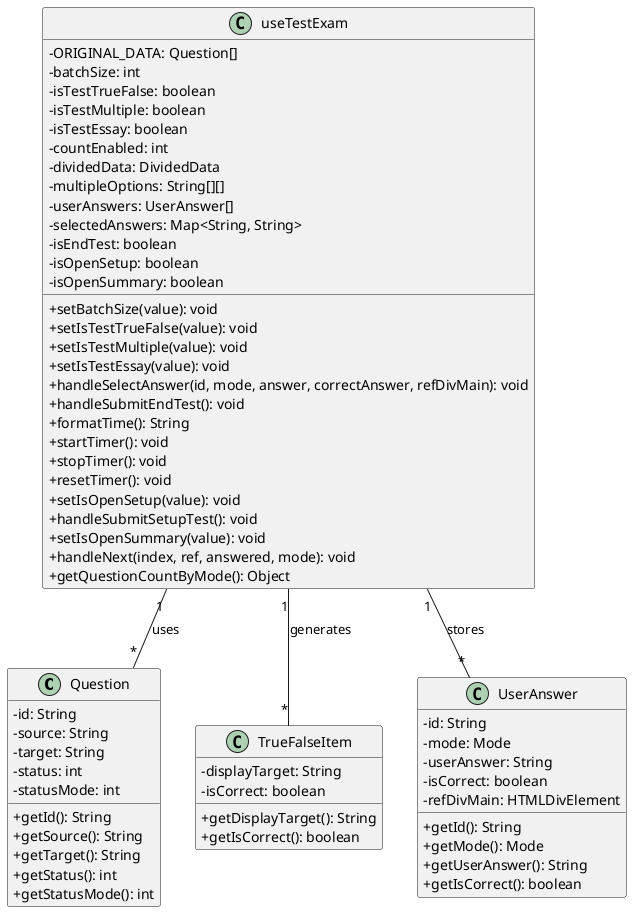
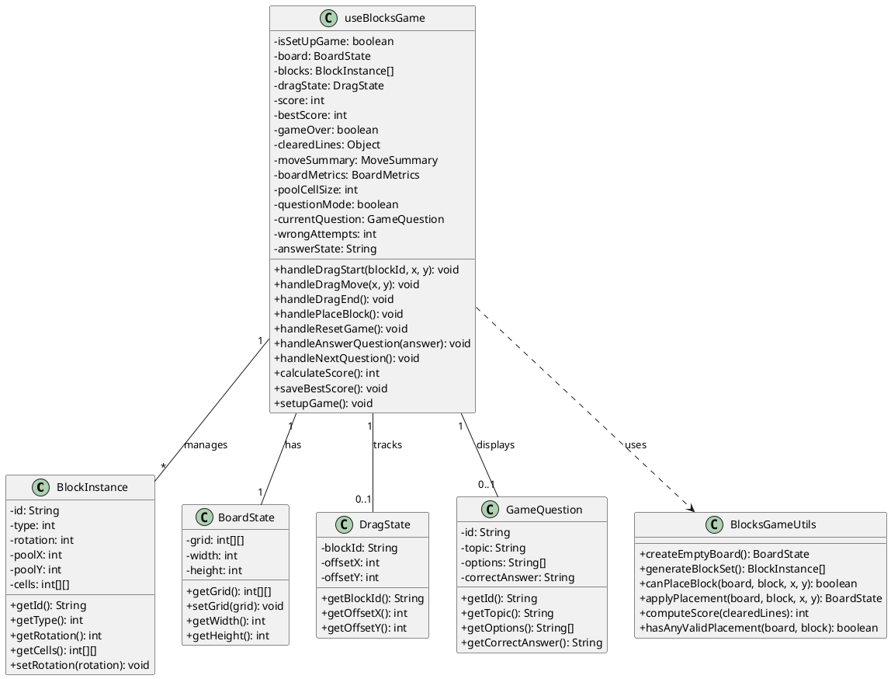
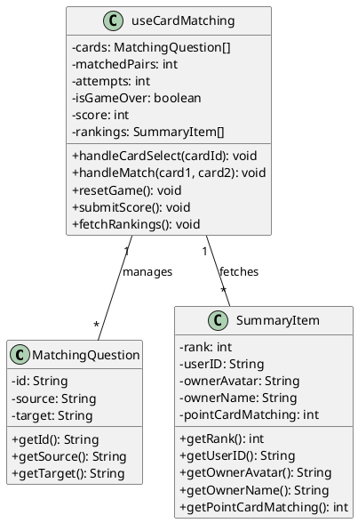
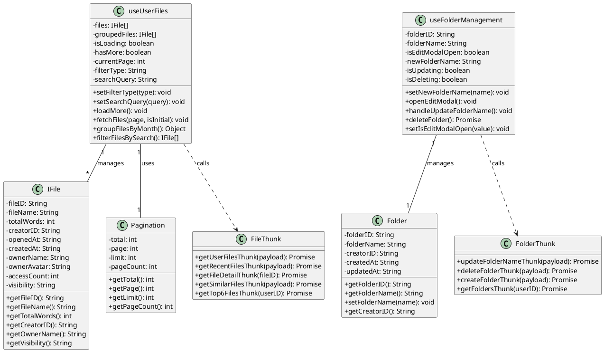
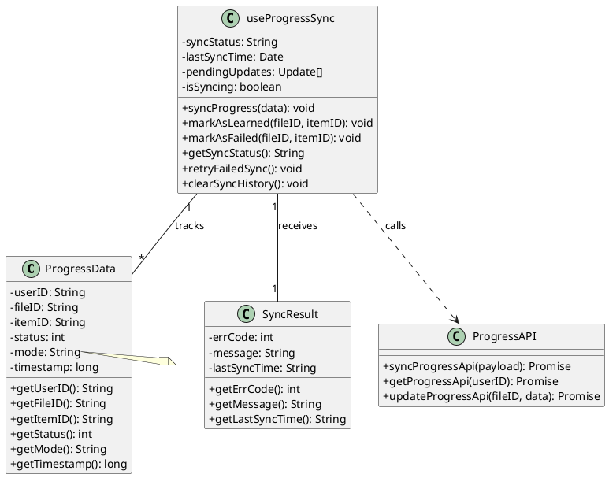
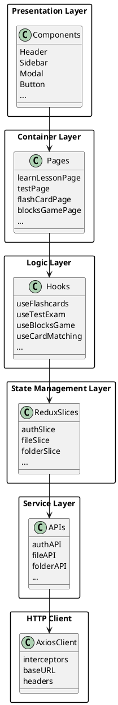
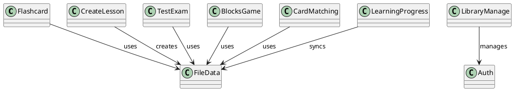

# LearnFast - Biểu đồ Class Diagram (PlantUML)

Tài liệu này mô tả chi tiết các class, attributes và methods cho từng chức năng chính của ứng dụng LearnFast sử dụng định dạng PlantUML.

---

## 📋 Mục lục

1. [Authentication (Xác thực)](#authentication)
2. [Create Lesson (Tạo bài học)](#create-lesson)
3. [Flashcard (Thẻ ghi nhớ)](#flashcard)
4. [Test Exam (Bài kiểm tra)](#test-exam)
5. [Blocks Game (Trò chơi xếp khối)](#blocks-game)
6. [Card Matching (Ghép cặp)](#card-matching)
7. [Library Management (Quản lý thư viện)](#library-management)
8. [Learning Progress (Theo dõi tiến độ)](#learning-progress)

---

## Authentication

### Chức năng: Đăng nhập / Đăng ký / Quản lý phiên

---

## Create Lesson

### Chức năng: Tạo bài học / Tạo flashcard bằng AI

---

## Flashcard

### Chức năng: Học thẻ ghi nhớ / Đánh dấu đã biết - chưa biết

---

## Test Exam

### Chức năng: Kiểm tra Đúng/Sai, Trắc nghiệm, Tự luận

---

## Blocks Game

### Chức năng: Trò chơi xếp khối kết hợp Q&A

---

## Card Matching

### Chức năng: Trò chơi ghép cặp thẻ / Xếp hạng

---

## Library Management

### Chức năng: Quản lý thư mục / File / Phân trang / Tìm kiếm

---

## Learning Progress

### Chức năng: Theo dõi tiến độ học tập / Đồng bộ dữ liệu

---

## 📊 Tổng quan Kiến trúc

---

## 🔗 Mối liên kết giữa các module

---

**Tài liệu này cập nhật lần cuối**: 06/01/2026
