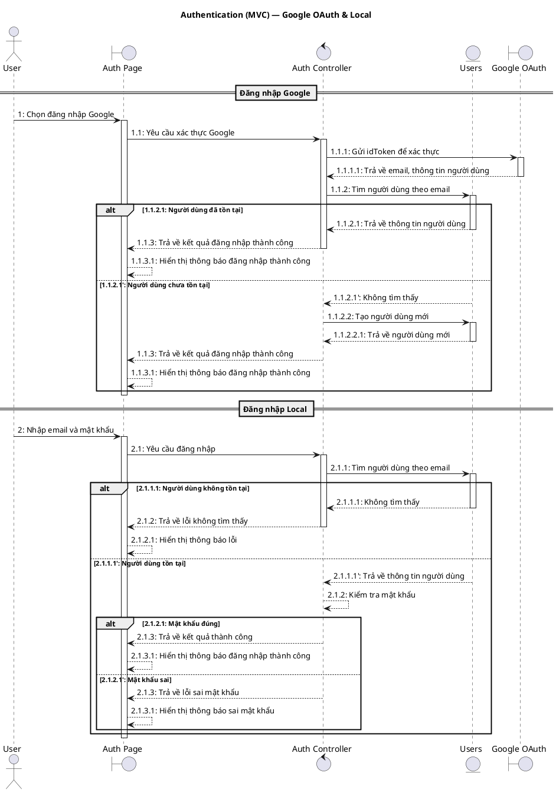
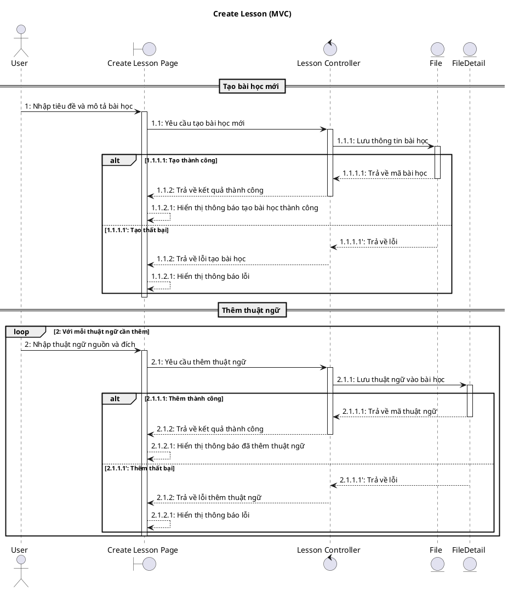
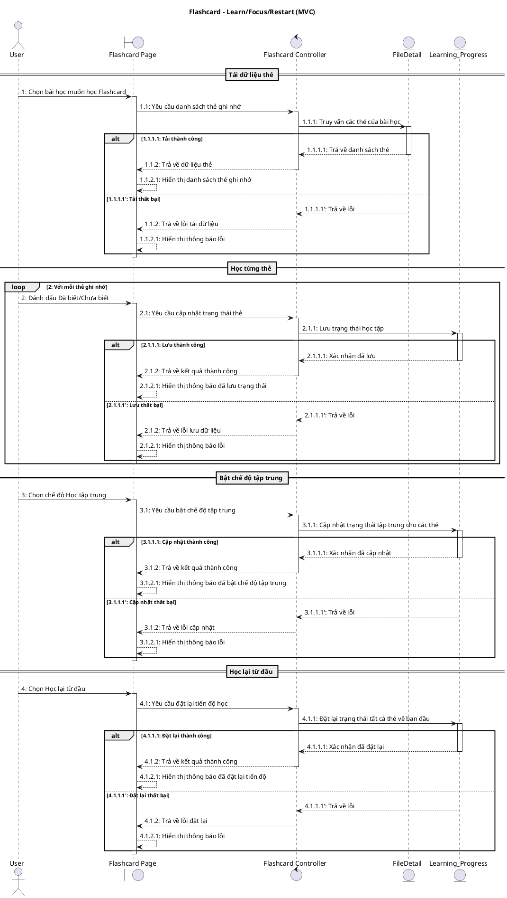
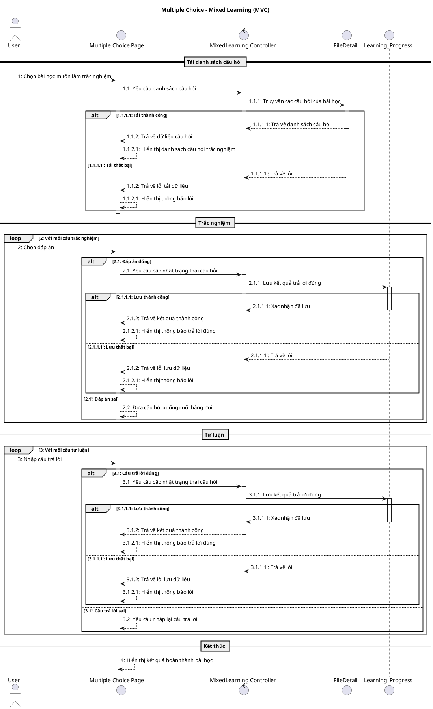
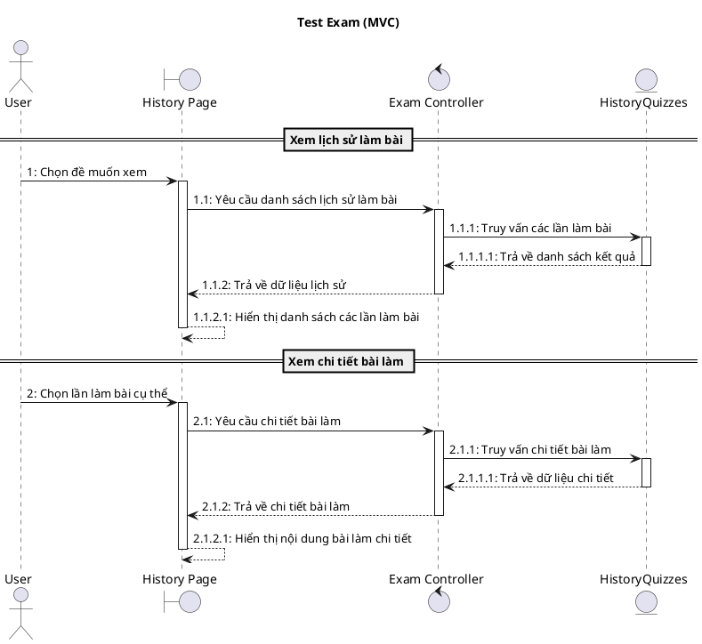
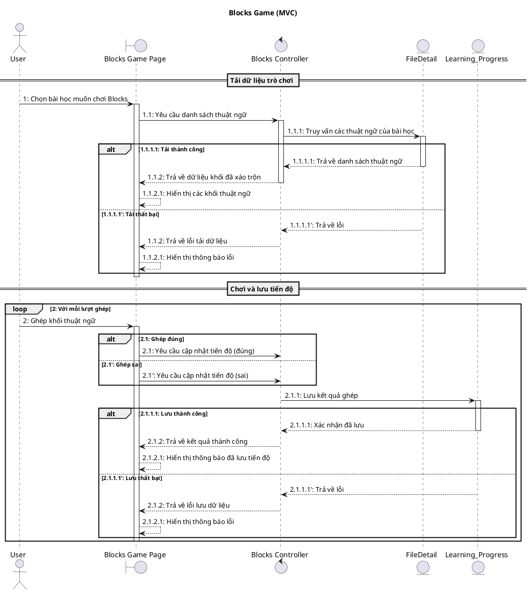
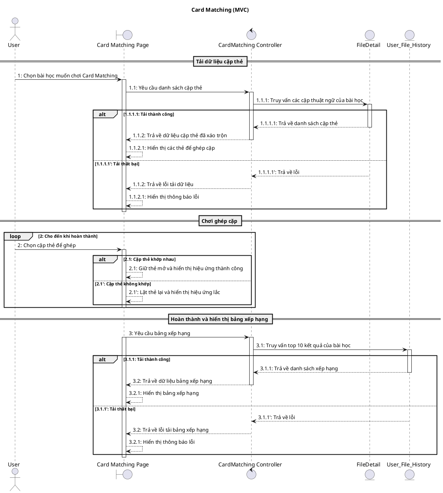
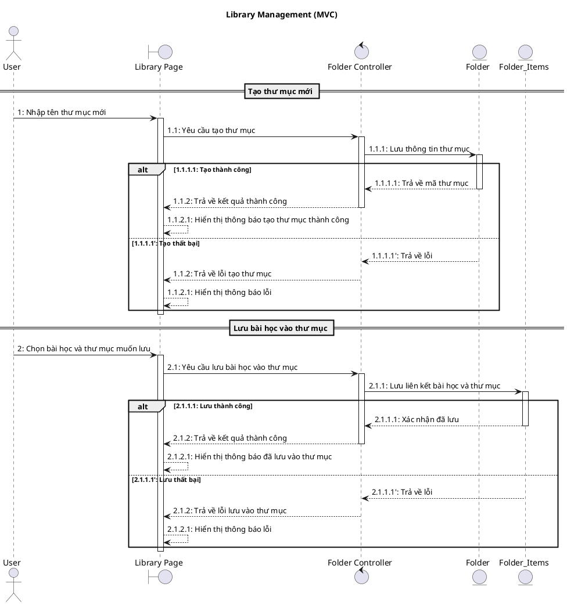
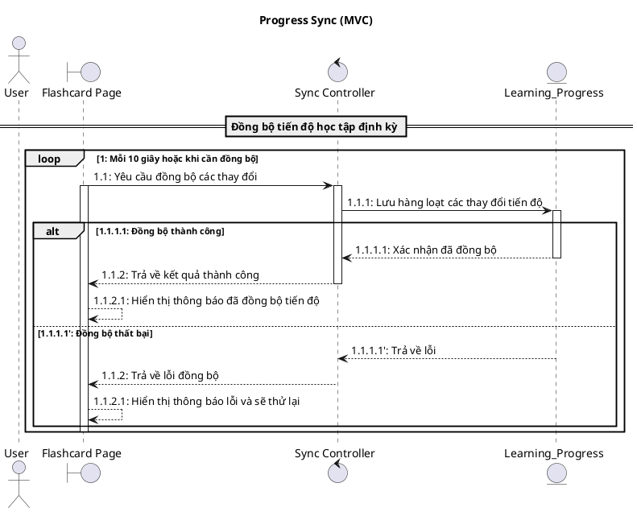

# LearnFast - Biểu đồ Sequence Diagram (MVC)

Tài liệu này mô tả các Sequence Diagram theo mô hình MVC cho các chức năng chính của ứng dụng LearnFast.

---

## 📋 Mục lục

1. [Quy ước MVC](#quy-ước-mvc)
2. [Authentication - Đăng nhập/Đăng ký](#authentication)
3. [Create Lesson - Tạo bài học](#create-lesson)
4. [Flashcard - Học thẻ ghi nhớ](#flashcard)
5. [Multiple Choice - Trắc nghiệm](#multiple-choice)
6. [Test Exam - Làm bài kiểm tra](#test-exam)
7. [Blocks Game - Trò chơi xếp khối](#blocks-game)
8. [Card Matching - Ghép cặp thẻ](#card-matching)
9. [Library Management - Quản lý thư viện](#library-management)
10. [Progress Sync - Đồng bộ tiến độ](#progress-sync)

---

## Quy ước MVC

### Stereotype UML

| Thành phần | Stereotype | Ký hiệu PlantUML | Ví dụ                  |
| ---------- | ---------- | ---------------- | ---------------------- |
| Actor      | `actor`    | `actor`          | `actor "User" as User` |
| View       | `boundary` | `boundary`       | `:AuthView`            |
| Controller | `control`  | `control`        | `:AuthController`      |
| Model      | `entity`   | `entity`         | `:Users`               |

### Các Model trong hệ thống

- `:Users` - Quản lý người dùng
- `:File` - Quản lý bài học (file)
- `:FileDetail` - Chi tiết thuật ngữ trong bài học
- `:Folder` - Quản lý thư mục
- `:Folder_Items` - Liên kết file-thư mục
- `:Learning_Progress` - Tiến độ học tập
- `:User_File_History` - Lịch sử điểm số/thời gian

---

## Authentication

### Sequence Diagram (MVC): Đăng nhập Google & Local

#### Bảng mô tả: Authentication (MVC)

| Bước      | Nội dung message                        | Mô tả                                |
| --------- | --------------------------------------- | ------------------------------------ |
| 1         | Chọn đăng nhập Google                   | User chọn nút đăng nhập Google       |
| 1.1       | Yêu cầu xác thực Google                 | View gửi yêu cầu đến Controller      |
| 1.1.1     | Gửi idToken để xác thực                 | Controller xác thực với Google OAuth |
| 1.1.1.1   | Trả về email, thông tin người dùng      | Google trả về thông tin user         |
| 1.1.2     | Tìm người dùng theo email               | Controller tìm user trong Model      |
| 1.1.2.1   | Trả về thông tin người dùng             | Model trả user cho Controller        |
| 1.1.2.1'  | Không tìm thấy                          | User chưa tồn tại                    |
| 1.1.2.2   | Tạo người dùng mới                      | Controller yêu cầu tạo user mới      |
| 1.1.2.2.1 | Trả về người dùng mới                   | Model trả user mới                   |
| 1.1.3     | Trả về kết quả đăng nhập thành công     | Controller trả kết quả cho View      |
| 1.1.3.1   | Hiển thị thông báo đăng nhập thành công | View hiển thị thông báo              |
| 2         | Nhập email và mật khẩu                  | User nhập thông tin đăng nhập local  |
| 2.1       | Yêu cầu đăng nhập                       | View gọi Controller                  |
| 2.1.1     | Tìm người dùng theo email               | Controller tìm user                  |
| 2.1.1.1   | Không tìm thấy / Trả về thông tin       | Model trả về kết quả                 |
| 2.1.2     | Kiểm tra mật khẩu                       | Controller kiểm tra mật khẩu         |
| 2.1.3     | Trả về kết quả thành công/lỗi           | Controller trả kết quả               |
| 2.1.3.1   | Hiển thị thông báo                      | View hiển thị thông báo              |

---

## Create Lesson

### Sequence Diagram (MVC): Tạo bài học

#### Bảng mô tả: Create Lesson (MVC)

| Bước    | Nội dung message                          | Mô tả                           |
| ------- | ----------------------------------------- | ------------------------------- |
| 1       | Nhập tiêu đề và mô tả bài học             | User nhập thông tin bài học     |
| 1.1     | Yêu cầu tạo bài học mới                   | View gửi yêu cầu đến Controller |
| 1.1.1   | Lưu thông tin bài học                     | Controller gọi Model File       |
| 1.1.1.1 | Trả về mã bài học                         | Model trả kết quả               |
| 1.1.2   | Trả về kết quả thành công                 | Controller trả về View          |
| 1.1.2.1 | Hiển thị thông báo tạo bài học thành công | View hiển thị thông báo         |
| 2       | Nhập thuật ngữ nguồn và đích              | User nhập thuật ngữ             |
| 2.1     | Yêu cầu thêm thuật ngữ                    | View gọi Controller             |
| 2.1.1   | Lưu thuật ngữ vào bài học                 | Controller gọi Model FileDetail |
| 2.1.1.1 | Trả về mã thuật ngữ                       | Model trả kết quả               |
| 2.1.2   | Trả về kết quả thành công                 | Controller trả về View          |
| 2.1.2.1 | Hiển thị thông báo đã thêm thuật ngữ      | View hiển thị thông báo         |

---

## Flashcard

### Sequence Diagram (MVC): Flashcard - Learn/Focus/Restart

#### Bảng mô tả: Flashcard (MVC)

| Bước    | Nội dung message                           | Mô tả                           |
| ------- | ------------------------------------------ | ------------------------------- |
| 1       | Chọn bài học muốn học Flashcard            | User mở trang Flashcard         |
| 1.1     | Yêu cầu danh sách thẻ ghi nhớ              | View yêu cầu Controller         |
| 1.1.1   | Truy vấn các thẻ của bài học               | Controller gọi Model FileDetail |
| 1.1.1.1 | Trả về danh sách thẻ                       | Model trả kết quả               |
| 1.1.2   | Trả về dữ liệu thẻ                         | Controller trả về View          |
| 1.1.2.1 | Hiển thị danh sách thẻ ghi nhớ             | View hiển thị cho User          |
| 2       | Đánh dấu Đã biết/Chưa biết                 | User đánh dấu thẻ               |
| 2.1     | Yêu cầu cập nhật trạng thái thẻ            | View gọi Controller             |
| 2.1.1   | Lưu trạng thái học tập                     | Controller gọi Model            |
| 2.1.1.1 | Xác nhận đã lưu                            | Model trả kết quả               |
| 2.1.2   | Trả về kết quả thành công                  | Controller trả về View          |
| 2.1.2.1 | Hiển thị thông báo đã lưu trạng thái       | View hiển thị thông báo         |
| 3       | Chọn chế độ Học tập trung                  | User bật chế độ focus           |
| 3.1     | Yêu cầu bật chế độ tập trung               | View gọi Controller             |
| 3.1.1   | Cập nhật trạng thái tập trung cho các thẻ  | Controller gọi Model            |
| 3.1.1.1 | Xác nhận đã cập nhật                       | Model trả kết quả               |
| 3.1.2   | Trả về kết quả thành công                  | Controller trả về View          |
| 3.1.2.1 | Hiển thị thông báo đã bật chế độ tập trung | View hiển thị thông báo         |
| 4       | Chọn Học lại từ đầu                        | User muốn học lại từ đầu        |
| 4.1     | Yêu cầu đặt lại tiến độ học                | View gọi Controller             |
| 4.1.1   | Đặt lại trạng thái tất cả thẻ về ban đầu   | Controller gọi Model            |
| 4.1.1.1 | Xác nhận đã đặt lại                        | Model trả kết quả               |
| 4.1.2   | Trả về kết quả thành công                  | Controller trả về View          |
| 4.1.2.1 | Hiển thị thông báo đã đặt lại tiến độ      | View hiển thị thông báo         |

---

## Multiple Choice

### Sequence Diagram (MVC): Trắc nghiệm + Tự luận

#### Bảng mô tả: Multiple Choice (MVC)

| Bước    | Nội dung message                       | Mô tả                             |
| ------- | -------------------------------------- | --------------------------------- |
| 1       | Chọn bài học muốn làm trắc nghiệm      | User mở trang trắc nghiệm         |
| 1.1     | Yêu cầu danh sách câu hỏi              | View yêu cầu Controller           |
| 1.1.1   | Truy vấn các câu hỏi của bài học       | Controller gọi Model FileDetail   |
| 1.1.1.1 | Trả về danh sách câu hỏi               | Model trả kết quả                 |
| 1.1.2   | Trả về dữ liệu câu hỏi                 | Controller trả về View            |
| 1.1.2.1 | Hiển thị danh sách câu hỏi trắc nghiệm | View hiển thị cho User            |
| 2       | Chọn đáp án                            | User chọn đáp án trắc nghiệm      |
| 2.1     | Yêu cầu cập nhật trạng thái câu hỏi    | View gọi Controller (đáp án đúng) |
| 2.1.1   | Lưu kết quả trả lời đúng               | Controller gọi Model              |
| 2.1.1.1 | Xác nhận đã lưu                        | Model trả kết quả                 |
| 2.1.2   | Trả về kết quả thành công              | Controller trả về View            |
| 2.1.2.1 | Hiển thị thông báo trả lời đúng        | View hiển thị thông báo           |
| 2.2     | Đưa câu hỏi xuống cuối hàng đợi        | Đáp án sai, lặp lại               |
| 3       | Nhập câu trả lời                       | User nhập đáp án tự luận          |
| 3.1     | Yêu cầu cập nhật trạng thái câu hỏi    | View gọi Controller (đáp án đúng) |
| 3.1.1   | Lưu kết quả trả lời đúng               | Controller gọi Model              |
| 3.1.1.1 | Xác nhận đã lưu                        | Model trả kết quả                 |
| 3.1.2   | Trả về kết quả thành công              | Controller trả về View            |
| 3.1.2.1 | Hiển thị thông báo trả lời đúng        | View hiển thị thông báo           |
| 3.2     | Yêu cầu nhập lại câu trả lời           | Đáp án sai, lặp lại               |
| 4       | Hiển thị kết quả hoàn thành bài học    | Kết thúc vòng học                 |

---

## Test Exam

### Sequence Diagram (MVC): Bài kiểm tra

#### Bảng mô tả: Test Exam (MVC)

| Bước    | Nội dung message                   | Mô tả                               |
| ------- | ---------------------------------- | ----------------------------------- |
| 1       | Chọn đề muốn xem                   | User chọn bài kiểm tra              |
| 1.1     | Yêu cầu danh sách lịch sử làm bài  | View yêu cầu Controller             |
| 1.1.1   | Truy vấn các lần làm bài           | Controller gọi Model HistoryQuizzes |
| 1.1.1.1 | Trả về danh sách kết quả           | Model trả kết quả                   |
| 1.1.2   | Trả về dữ liệu lịch sử             | Controller trả về View              |
| 1.1.2.1 | Hiển thị danh sách các lần làm bài | View hiển thị cho User              |
| 2       | Chọn lần làm bài cụ thể            | User chọn xem chi tiết              |
| 2.1     | Yêu cầu chi tiết bài làm           | View gọi Controller                 |
| 2.1.1   | Truy vấn chi tiết bài làm          | Controller gọi Model                |
| 2.1.1.1 | Trả về dữ liệu chi tiết            | Model trả kết quả                   |
| 2.1.2   | Trả về chi tiết bài làm            | Controller trả về View              |
| 2.1.2.1 | Hiển thị nội dung bài làm chi tiết | View hiển thị cho User              |

---

## Blocks Game

### Sequence Diagram (MVC): Trò chơi xếp khối

#### Bảng mô tả: Blocks Game (MVC)

| Bước    | Nội dung message                    | Mô tả                           |
| ------- | ----------------------------------- | ------------------------------- |
| 1       | Chọn bài học muốn chơi Blocks       | User mở game Blocks             |
| 1.1     | Yêu cầu danh sách thuật ngữ         | View yêu cầu Controller         |
| 1.1.1   | Truy vấn các thuật ngữ của bài học  | Controller gọi Model FileDetail |
| 1.1.1.1 | Trả về danh sách thuật ngữ          | Model trả kết quả               |
| 1.1.2   | Trả về dữ liệu khối đã xáo trộn     | Controller trả về View          |
| 1.1.2.1 | Hiển thị các khối thuật ngữ         | View hiển thị cho User          |
| 2       | Ghép khối thuật ngữ                 | User ghép block                 |
| 2.1     | Yêu cầu cập nhật tiến độ (đúng/sai) | View gọi Controller             |
| 2.1.1   | Lưu kết quả ghép                    | Controller gọi Model            |
| 2.1.1.1 | Xác nhận đã lưu                     | Model trả kết quả               |
| 2.1.2   | Trả về kết quả thành công           | Controller trả về View          |
| 2.1.2.1 | Hiển thị thông báo đã lưu tiến độ   | View hiển thị thông báo         |

---

## Card Matching

### Sequence Diagram (MVC): Ghép cặp thẻ

#### Bảng mô tả: Card Matching (MVC)

| Bước    | Nội dung message                           | Mô tả                           |
| ------- | ------------------------------------------ | ------------------------------- |
| 1       | Chọn bài học muốn chơi Card Matching       | User mở game ghép thẻ           |
| 1.1     | Yêu cầu danh sách cặp thẻ                  | View yêu cầu Controller         |
| 1.1.1   | Truy vấn các cặp thuật ngữ của bài học     | Controller gọi Model FileDetail |
| 1.1.1.1 | Trả về danh sách cặp thẻ                   | Model trả kết quả               |
| 1.1.2   | Trả về dữ liệu cặp thẻ đã xáo trộn         | Controller trả về View          |
| 1.1.2.1 | Hiển thị các thẻ để ghép cặp               | View hiển thị cho User          |
| 2       | Chọn cặp thẻ để ghép                       | User chọn thẻ để ghép           |
| 2.1     | Giữ thẻ mở và hiển thị hiệu ứng thành công | Cặp thẻ khớp nhau               |
| 2.1'    | Lật thẻ lại và hiển thị hiệu ứng lắc       | Cặp thẻ không khớp              |
| 3       | Yêu cầu bảng xếp hạng                      | View yêu cầu bảng xếp hạng      |
| 3.1     | Truy vấn top 10 kết quả của bài học        | Controller gọi Model History    |
| 3.1.1   | Trả về danh sách xếp hạng                  | Model trả kết quả               |
| 3.2     | Trả về dữ liệu bảng xếp hạng               | Controller trả về View          |
| 3.2.1   | Hiển thị bảng xếp hạng                     | View hiển thị cho User          |

---

## Library Management

### Sequence Diagram (MVC): Quản lý thư viện

#### Bảng mô tả: Library Management (MVC)

| Bước    | Nội dung message                          | Mô tả                             |
| ------- | ----------------------------------------- | --------------------------------- |
| 1       | Nhập tên thư mục mới                      | User nhập tên thư mục mới         |
| 1.1     | Yêu cầu tạo thư mục                       | View gọi Controller               |
| 1.1.1   | Lưu thông tin thư mục                     | Controller gọi Model Folder       |
| 1.1.1.1 | Trả về mã thư mục                         | Model trả kết quả                 |
| 1.1.2   | Trả về kết quả thành công                 | Controller trả về View            |
| 1.1.2.1 | Hiển thị thông báo tạo thư mục thành công | View hiển thị thông báo           |
| 2       | Chọn bài học và thư mục muốn lưu          | User chọn file và thư mục         |
| 2.1     | Yêu cầu lưu bài học vào thư mục           | View gọi Controller               |
| 2.1.1   | Lưu liên kết bài học và thư mục           | Controller gọi Model Folder_Items |
| 2.1.1.1 | Xác nhận đã lưu                           | Model trả kết quả                 |
| 2.1.2   | Trả về kết quả thành công                 | Controller trả về View            |
| 2.1.2.1 | Hiển thị thông báo đã lưu vào thư mục     | View hiển thị thông báo           |

---

## Progress Sync

### Sequence Diagram (MVC): Đồng bộ tiến độ

#### Bảng mô tả: Progress Sync (MVC)

| Bước    | Nội dung message                      | Mô tả                   |
| ------- | ------------------------------------- | ----------------------- |
| 1       | Loop mỗi 10 giây                      | Chu kỳ đồng bộ định kỳ  |
| 1.1     | Yêu cầu đồng bộ các thay đổi          | View đẩy batch thay đổi |
| 1.1.1   | Lưu hàng loạt các thay đổi tiến độ    | Controller gọi Model    |
| 1.1.1.1 | Xác nhận đã đồng bộ                   | Model trả kết quả       |
| 1.1.2   | Trả về kết quả thành công             | Controller trả về View  |
| 1.1.2.1 | Hiển thị thông báo đã đồng bộ tiến độ | View hiển thị thông báo |

---

## 📝 Hướng dẫn render PlantUML

### VS Code Extensions

- PlantUML extension
- Markdown Preview Enhanced

### Online Tools

- [PlantUML Web Server](http://www.plantuml.com/plantuml)
- [PlantText](https://www.planttext.com/)

---

**Cập nhật lần cuối**: 08/01/2026
