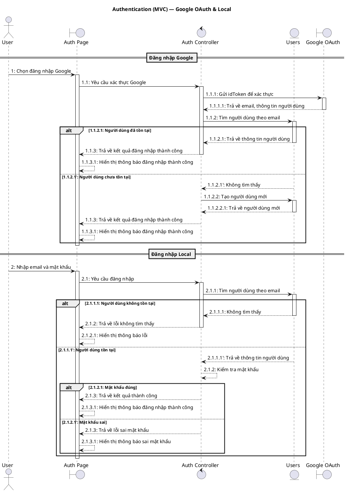
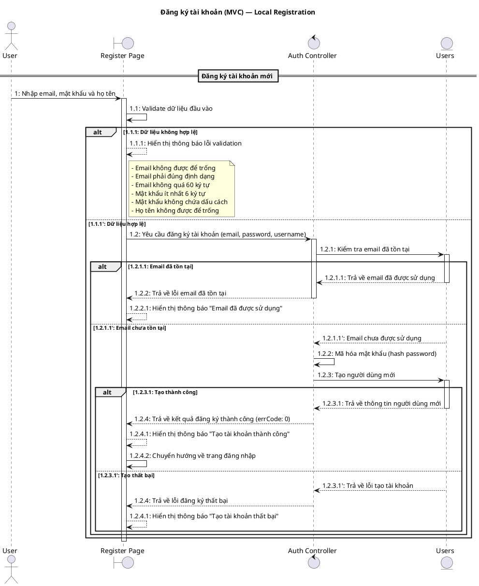
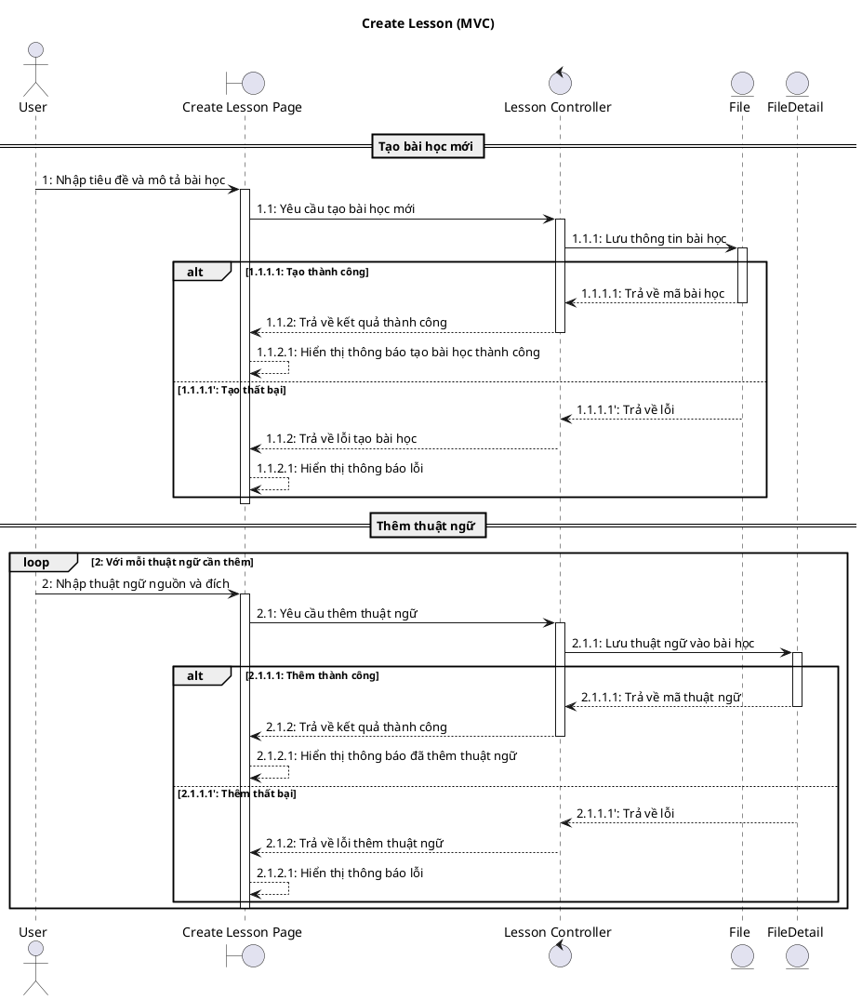
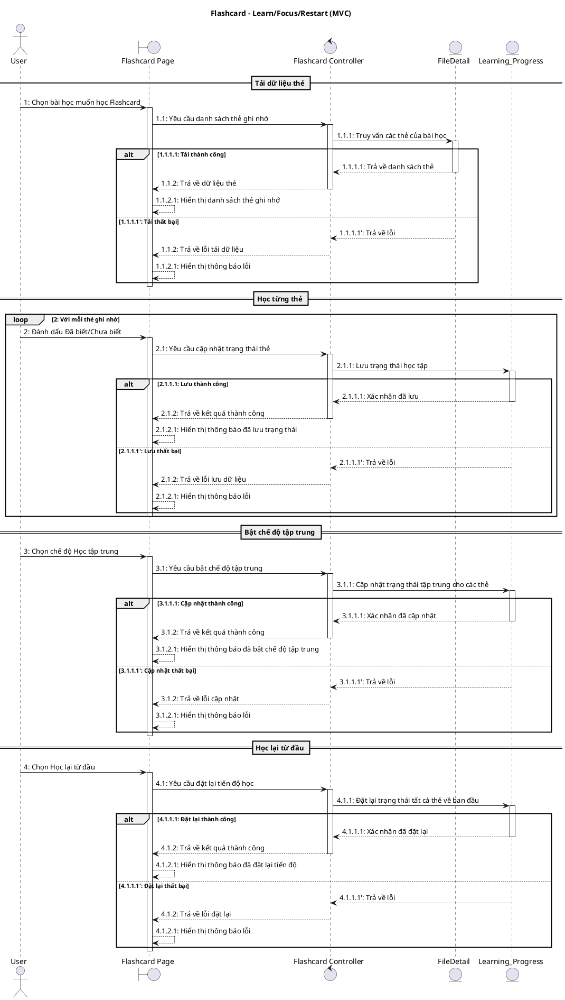
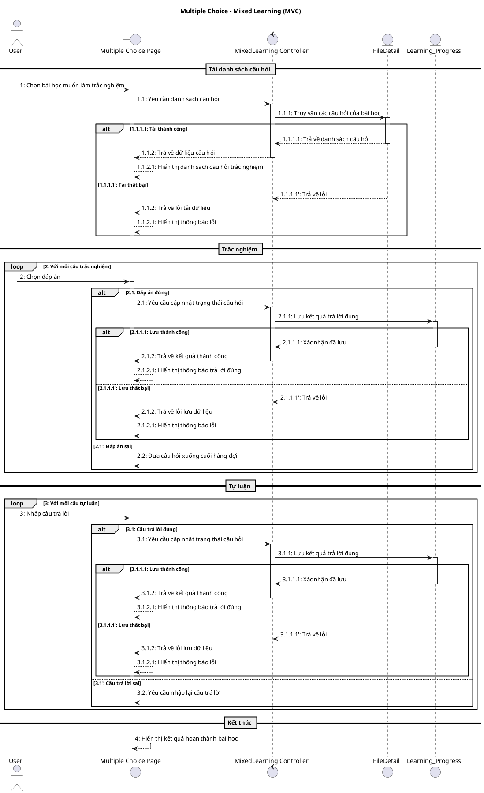
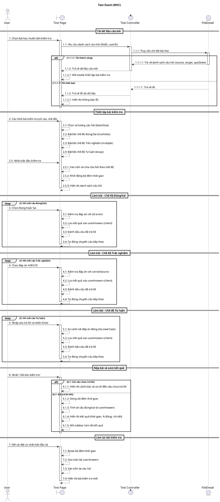
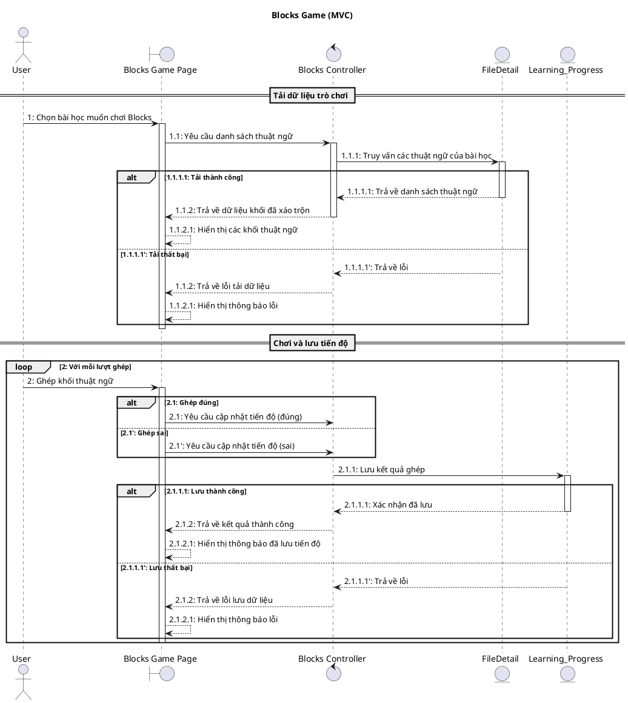
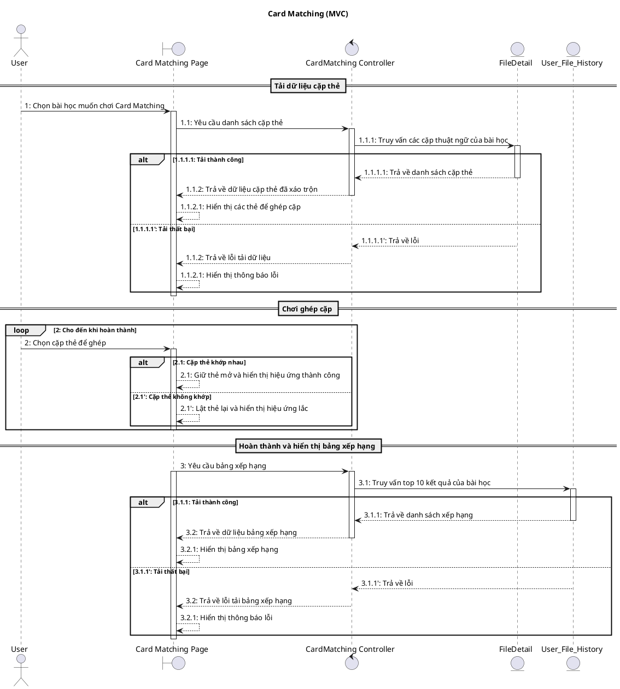
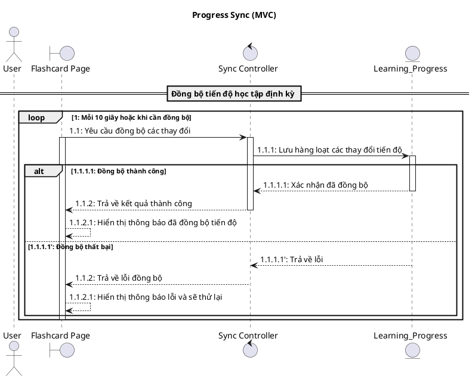

# LearnFast - Biểu đồ Sequence Diagram (MVC)

Tài liệu này mô tả các Sequence Diagram theo mô hình MVC cho các chức năng chính của ứng dụng LearnFast.

---

## 📋 Mục lục

1. [Quy ước MVC](#quy-ước-mvc)
2. [Authentication - Đăng nhập/Đăng ký](#authentication)
3. [Create Lesson - Tạo bài học](#create-lesson)
4. [Flashcard - Học thẻ ghi nhớ](#flashcard)
5. [Multiple Choice - Trắc nghiệm](#multiple-choice)
6. [Test Exam - Làm bài kiểm tra](#test-exam)
7. [Blocks Game - Trò chơi xếp khối](#blocks-game)
8. [Card Matching - Ghép cặp thẻ](#card-matching)
9. [Library Management - Quản lý thư viện](#library-management)
10. [Progress Sync - Đồng bộ tiến độ](#progress-sync)

---

## Quy ước MVC

### Stereotype UML

| Thành phần | Stereotype | Ký hiệu PlantUML | Ví dụ                  |
| ---------- | ---------- | ---------------- | ---------------------- |
| Actor      | `actor`    | `actor`          | `actor "User" as User` |
| View       | `boundary` | `boundary`       | `:AuthView`            |
| Controller | `control`  | `control`        | `:AuthController`      |
| Model      | `entity`   | `entity`         | `:Users`               |

### Các Model trong hệ thống

- `:Users` - Quản lý người dùng
- `:File` - Quản lý bài học (file)
- `:FileDetail` - Chi tiết thuật ngữ trong bài học
- `:Folder` - Quản lý thư mục
- `:Folder_Items` - Liên kết file-thư mục
- `:Learning_Progress` - Tiến độ học tập
- `:User_File_History` - Lịch sử điểm số/thời gian

---

## Authentication

### Sequence Diagram (MVC): Đăng nhập Google & Local

#### Bảng mô tả: Authentication (MVC)

| Bước      | Nội dung message                        | Mô tả                                |
| --------- | --------------------------------------- | ------------------------------------ |
| 1         | Chọn đăng nhập Google                   | User chọn nút đăng nhập Google       |
| 1.1       | Yêu cầu xác thực Google                 | View gửi yêu cầu đến Controller      |
| 1.1.1     | Gửi idToken để xác thực                 | Controller xác thực với Google OAuth |
| 1.1.1.1   | Trả về email, thông tin người dùng      | Google trả về thông tin user         |
| 1.1.2     | Tìm người dùng theo email               | Controller tìm user trong Model      |
| 1.1.2.1   | Trả về thông tin người dùng             | Model trả user cho Controller        |
| 1.1.2.1'  | Không tìm thấy                          | User chưa tồn tại                    |
| 1.1.2.2   | Tạo người dùng mới                      | Controller yêu cầu tạo user mới      |
| 1.1.2.2.1 | Trả về người dùng mới                   | Model trả user mới                   |
| 1.1.3     | Trả về kết quả đăng nhập thành công     | Controller trả kết quả cho View      |
| 1.1.3.1   | Hiển thị thông báo đăng nhập thành công | View hiển thị thông báo              |
| 2         | Nhập email và mật khẩu                  | User nhập thông tin đăng nhập local  |
| 2.1       | Yêu cầu đăng nhập                       | View gọi Controller                  |
| 2.1.1     | Tìm người dùng theo email               | Controller tìm user                  |
| 2.1.1.1   | Không tìm thấy / Trả về thông tin       | Model trả về kết quả                 |
| 2.1.2     | Kiểm tra mật khẩu                       | Controller kiểm tra mật khẩu         |
| 2.1.3     | Trả về kết quả thành công/lỗi           | Controller trả kết quả               |
| 2.1.3.1   | Hiển thị thông báo                      | View hiển thị thông báo              |

---

### Sequence Diagram (MVC): Đăng ký tài khoản Local

#### Bảng mô tả: Đăng ký tài khoản (MVC)

| Bước     | Nội dung message                                      | Mô tả                                    |
| -------- | ----------------------------------------------------- | ---------------------------------------- |
| 1        | Nhập email, mật khẩu và họ tên                        | User điền thông tin đăng ký              |
| 1.1      | Validate dữ liệu đầu vào                              | View kiểm tra tính hợp lệ của dữ liệu    |
| 1.1.1    | Hiển thị thông báo lỗi validation                     | Dữ liệu không hợp lệ, hiển thị lỗi       |
| 1.1.1'   | Dữ liệu hợp lệ                                        | Tiếp tục xử lý đăng ký                   |
| 1.2      | Yêu cầu đăng ký tài khoản (email, password, username) | View gửi request đến Controller          |
| 1.2.1    | Kiểm tra email đã tồn tại                             | Controller kiểm tra email trong Model    |
| 1.2.1.1  | Trả về email đã được sử dụng                          | Email đã tồn tại trong hệ thống          |
| 1.2.1.1' | Email chưa được sử dụng                               | Email chưa tồn tại, có thể đăng ký       |
| 1.2.2    | Mã hóa mật khẩu (hash password)                       | Controller mã hóa mật khẩu trước khi lưu |
| 1.2.3    | Tạo người dùng mới                                    | Controller yêu cầu Model tạo user mới    |
| 1.2.3.1  | Trả về thông tin người dùng mới                       | Model tạo thành công và trả về user      |
| 1.2.3.1' | Trả về lỗi tạo tài khoản                              | Model tạo thất bại                       |
| 1.2.4    | Trả về kết quả đăng ký thành công/thất bại            | Controller trả kết quả về View           |
| 1.2.4.1  | Hiển thị thông báo                                    | View hiển thị thông báo cho user         |
| 1.2.4.2  | Chuyển hướng về trang đăng nhập                       | Đăng ký thành công, redirect về login    |

#### Các validation rules

| Field    | Rule                 | Thông báo lỗi                        |
| -------- | -------------------- | ------------------------------------ |
| Email    | Không được để trống  | "Email không được để trống"          |
| Email    | Đúng định dạng email | "Email phải đúng định dạng"          |
| Email    | Không quá 60 ký tự   | "Email không được vượt quá 60 ký tự" |
| Password | Ít nhất 6 ký tự      | "Mật khẩu phải có ít nhất 6 ký tự"   |
| Password | Không chứa dấu cách  | "Mật khẩu không được chứa dấu cách"  |
| Username | Không được để trống  | "Họ và tên không được để trống"      |

---

## Create Lesson

### Sequence Diagram (MVC): Tạo bài học

#### Bảng mô tả: Create Lesson (MVC)

| Bước    | Nội dung message                          | Mô tả                           |
| ------- | ----------------------------------------- | ------------------------------- |
| 1       | Nhập tiêu đề và mô tả bài học             | User nhập thông tin bài học     |
| 1.1     | Yêu cầu tạo bài học mới                   | View gửi yêu cầu đến Controller |
| 1.1.1   | Lưu thông tin bài học                     | Controller gọi Model File       |
| 1.1.1.1 | Trả về mã bài học                         | Model trả kết quả               |
| 1.1.2   | Trả về kết quả thành công                 | Controller trả về View          |
| 1.1.2.1 | Hiển thị thông báo tạo bài học thành công | View hiển thị thông báo         |
| 2       | Nhập thuật ngữ nguồn và đích              | User nhập thuật ngữ             |
| 2.1     | Yêu cầu thêm thuật ngữ                    | View gọi Controller             |
| 2.1.1   | Lưu thuật ngữ vào bài học                 | Controller gọi Model FileDetail |
| 2.1.1.1 | Trả về mã thuật ngữ                       | Model trả kết quả               |
| 2.1.2   | Trả về kết quả thành công                 | Controller trả về View          |
| 2.1.2.1 | Hiển thị thông báo đã thêm thuật ngữ      | View hiển thị thông báo         |

---

## Flashcard

### Sequence Diagram (MVC): Flashcard - Learn/Focus/Restart

#### Bảng mô tả: Flashcard (MVC)

| Bước    | Nội dung message                           | Mô tả                           |
| ------- | ------------------------------------------ | ------------------------------- |
| 1       | Chọn bài học muốn học Flashcard            | User mở trang Flashcard         |
| 1.1     | Yêu cầu danh sách thẻ ghi nhớ              | View yêu cầu Controller         |
| 1.1.1   | Truy vấn các thẻ của bài học               | Controller gọi Model FileDetail |
| 1.1.1.1 | Trả về danh sách thẻ                       | Model trả kết quả               |
| 1.1.2   | Trả về dữ liệu thẻ                         | Controller trả về View          |
| 1.1.2.1 | Hiển thị danh sách thẻ ghi nhớ             | View hiển thị cho User          |
| 2       | Đánh dấu Đã biết/Chưa biết                 | User đánh dấu thẻ               |
| 2.1     | Yêu cầu cập nhật trạng thái thẻ            | View gọi Controller             |
| 2.1.1   | Lưu trạng thái học tập                     | Controller gọi Model            |
| 2.1.1.1 | Xác nhận đã lưu                            | Model trả kết quả               |
| 2.1.2   | Trả về kết quả thành công                  | Controller trả về View          |
| 2.1.2.1 | Hiển thị thông báo đã lưu trạng thái       | View hiển thị thông báo         |
| 3       | Chọn chế độ Học tập trung                  | User bật chế độ focus           |
| 3.1     | Yêu cầu bật chế độ tập trung               | View gọi Controller             |
| 3.1.1   | Cập nhật trạng thái tập trung cho các thẻ  | Controller gọi Model            |
| 3.1.1.1 | Xác nhận đã cập nhật                       | Model trả kết quả               |
| 3.1.2   | Trả về kết quả thành công                  | Controller trả về View          |
| 3.1.2.1 | Hiển thị thông báo đã bật chế độ tập trung | View hiển thị thông báo         |
| 4       | Chọn Học lại từ đầu                        | User muốn học lại từ đầu        |
| 4.1     | Yêu cầu đặt lại tiến độ học                | View gọi Controller             |
| 4.1.1   | Đặt lại trạng thái tất cả thẻ về ban đầu   | Controller gọi Model            |
| 4.1.1.1 | Xác nhận đã đặt lại                        | Model trả kết quả               |
| 4.1.2   | Trả về kết quả thành công                  | Controller trả về View          |
| 4.1.2.1 | Hiển thị thông báo đã đặt lại tiến độ      | View hiển thị thông báo         |

---

## Multiple Choice

### Sequence Diagram (MVC): Trắc nghiệm + Tự luận

#### Bảng mô tả: Multiple Choice (MVC)

| Bước    | Nội dung message                       | Mô tả                             |
| ------- | -------------------------------------- | --------------------------------- |
| 1       | Chọn bài học muốn làm trắc nghiệm      | User mở trang trắc nghiệm         |
| 1.1     | Yêu cầu danh sách câu hỏi              | View yêu cầu Controller           |
| 1.1.1   | Truy vấn các câu hỏi của bài học       | Controller gọi Model FileDetail   |
| 1.1.1.1 | Trả về danh sách câu hỏi               | Model trả kết quả                 |
| 1.1.2   | Trả về dữ liệu câu hỏi                 | Controller trả về View            |
| 1.1.2.1 | Hiển thị danh sách câu hỏi trắc nghiệm | View hiển thị cho User            |
| 2       | Chọn đáp án                            | User chọn đáp án trắc nghiệm      |
| 2.1     | Yêu cầu cập nhật trạng thái câu hỏi    | View gọi Controller (đáp án đúng) |
| 2.1.1   | Lưu kết quả trả lời đúng               | Controller gọi Model              |
| 2.1.1.1 | Xác nhận đã lưu                        | Model trả kết quả                 |
| 2.1.2   | Trả về kết quả thành công              | Controller trả về View            |
| 2.1.2.1 | Hiển thị thông báo trả lời đúng        | View hiển thị thông báo           |
| 2.2     | Đưa câu hỏi xuống cuối hàng đợi        | Đáp án sai, lặp lại               |
| 3       | Nhập câu trả lời                       | User nhập đáp án tự luận          |
| 3.1     | Yêu cầu cập nhật trạng thái câu hỏi    | View gọi Controller (đáp án đúng) |
| 3.1.1   | Lưu kết quả trả lời đúng               | Controller gọi Model              |
| 3.1.1.1 | Xác nhận đã lưu                        | Model trả kết quả                 |
| 3.1.2   | Trả về kết quả thành công              | Controller trả về View            |
| 3.1.2.1 | Hiển thị thông báo trả lời đúng        | View hiển thị thông báo           |
| 3.2     | Yêu cầu nhập lại câu trả lời           | Đáp án sai, lặp lại               |
| 4       | Hiển thị kết quả hoàn thành bài học    | Kết thúc vòng học                 |

---

## Test Exam

### Sequence Diagram (MVC): Bài kiểm tra

#### Bảng mô tả: Test Exam (MVC)

| Bước    | Nội dung message                                     | Mô tả                                           |
| ------- | ---------------------------------------------------- | ----------------------------------------------- |
| 1       | Chọn bài học muốn làm kiểm tra                       | User mở trang Test từ bài học                   |
| 1.1     | Yêu cầu danh sách câu hỏi (fileID, userID)           | View gọi Controller lấy dữ liệu                 |
| 1.1.1   | Truy vấn chi tiết bài học                            | Controller gọi Model FileDetail                 |
| 1.1.1.1 | Trả về danh sách câu hỏi (source, target, quizState) | Model trả kết quả                               |
| 1.1.2   | Trả về dữ liệu câu hỏi                               | Controller trả về View                          |
| 1.1.2.1 | Mở modal thiết lập bài kiểm tra                      | View hiển thị TestSetupModal                    |
| 2       | Cấu hình bài kiểm tra (số câu, chế độ)               | User thiết lập các tùy chọn                     |
| 2.1     | Chọn số lượng câu hỏi (batchSize)                    | Tối đa = tổng số câu trong bài                  |
| 2.2     | Bật/tắt chế độ Đúng/Sai (trueFalse)                  | Toggle on/off                                   |
| 2.3     | Bật/tắt chế độ Trắc nghiệm (multiple)                | Toggle on/off                                   |
| 2.4     | Bật/tắt chế độ Tự luận (essay)                       | Toggle on/off                                   |
| 2.5     | Nhấn bắt đầu kiểm tra                                | User xác nhận cấu hình                          |
| 2.5.1   | Xáo trộn và chia câu hỏi theo chế độ                 | Hook useTestExam xử lý phân chia                |
| 2.5.2   | Khởi động bộ đếm thời gian                           | Hook useTimer bắt đầu đếm                       |
| 2.5.3   | Hiển thị danh sách câu hỏi                           | View render theo dividedData                    |
| 3       | Chọn Đúng hoặc Sai                                   | User trả lời câu Đúng/Sai                       |
| 3.1     | Kiểm tra đáp án với isCorrect                        | So sánh với giá trị isCorrect của TrueFalseItem |
| 3.2     | Lưu kết quả vào userAnswers (client)                 | Lưu local state, không gọi API                  |
| 3.3     | Đánh dấu câu đã trả lời                              | Cập nhật answeredTrueFalse                      |
| 3.4     | Tự động chuyển câu tiếp theo                         | handleNext scroll đến câu kế                    |
| 4       | Chọn đáp án A/B/C/D                                  | User trả lời câu trắc nghiệm                    |
| 4.1     | Kiểm tra đáp án với correctSource                    | So sánh với source gốc                          |
| 4.2     | Lưu kết quả vào userAnswers (client)                 | Lưu local state                                 |
| 4.3     | Đánh dấu câu đã trả lời                              | Cập nhật answeredMultiple                       |
| 4.4     | Tự động chuyển câu tiếp theo                         | handleNext scroll đến câu kế                    |
| 5       | Nhập câu trả lời và nhấn Enter                       | User trả lời câu tự luận                        |
| 5.1     | So sánh với đáp án đúng (toLowerCase)                | So sánh không phân biệt hoa/thường              |
| 5.2     | Lưu kết quả vào userAnswers (client)                 | Lưu local state                                 |
| 5.3     | Đánh dấu câu đã trả lời                              | Cập nhật answeredEssay                          |
| 5.4     | Tự động chuyển câu tiếp theo                         | handleNext scroll đến câu kế                    |
| 6       | Nhấn "Gửi bài kiểm tra"                              | User nộp bài                                    |
| 6.1     | Còn câu chưa trả lời                                 | Kiểm tra answeredTrueFalse/Multiple/Essay       |
| 6.1.1   | Hiển thị cảnh báo và scroll đến câu chưa trả lời     | Alert + scroll tự động                          |
| 6.1.2   | Dừng bộ đếm thời gian                                | stopTimer()                                     |
| 6.1.3   | Tính số câu đúng/sai từ userAnswers                  | Filter userAnswers theo isCorrect               |
| 6.1.4   | Hiển thị kết quả (thời gian, % đúng, chi tiết)       | TestResult component                            |
| 6.1.5   | Mở sidebar tóm tắt kết quả                           | TestSummarySidebar hiển thị                     |
| 7       | Mở cài đặt và nhấn bắt đầu lại                       | User muốn làm lại                               |
| 7.1     | Reset bộ đếm thời gian                               | resetTimer()                                    |
| 7.2     | Xóa toàn bộ userAnswers                              | Clear state về rỗng                             |
| 7.3     | Xáo trộn lại câu hỏi                                 | getRandomItems tạo bộ mới                       |
| 7.4     | Hiển thị bài kiểm tra mới                            | Render lại câu hỏi                              |

#### Ghi chú quan trọng

> **Lưu ý**: Chức năng Test Exam hiện tại **chưa tích hợp lưu kết quả lên server**. Toàn bộ quá trình làm bài và kết quả được xử lý **hoàn toàn phía client (local state)**. Nếu user refresh trang, kết quả sẽ bị mất.
>
> Các tính năng có thể mở rộng trong tương lai:
>
> - Lưu lịch sử làm bài vào Model `HistoryQuizzes`
> - Xem lại kết quả các lần làm bài trước
> - Thống kê tiến độ học tập qua các bài kiểm tra

---

## Blocks Game

### Sequence Diagram (MVC): Trò chơi xếp khối

#### Bảng mô tả: Blocks Game (MVC)

| Bước    | Nội dung message                    | Mô tả                           |
| ------- | ----------------------------------- | ------------------------------- |
| 1       | Chọn bài học muốn chơi Blocks       | User mở game Blocks             |
| 1.1     | Yêu cầu danh sách thuật ngữ         | View yêu cầu Controller         |
| 1.1.1   | Truy vấn các thuật ngữ của bài học  | Controller gọi Model FileDetail |
| 1.1.1.1 | Trả về danh sách thuật ngữ          | Model trả kết quả               |
| 1.1.2   | Trả về dữ liệu khối đã xáo trộn     | Controller trả về View          |
| 1.1.2.1 | Hiển thị các khối thuật ngữ         | View hiển thị cho User          |
| 2       | Ghép khối thuật ngữ                 | User ghép block                 |
| 2.1     | Yêu cầu cập nhật tiến độ (đúng/sai) | View gọi Controller             |
| 2.1.1   | Lưu kết quả ghép                    | Controller gọi Model            |
| 2.1.1.1 | Xác nhận đã lưu                     | Model trả kết quả               |
| 2.1.2   | Trả về kết quả thành công           | Controller trả về View          |
| 2.1.2.1 | Hiển thị thông báo đã lưu tiến độ   | View hiển thị thông báo         |

---

## Card Matching

### Sequence Diagram (MVC): Ghép cặp thẻ

#### Bảng mô tả: Card Matching (MVC)

| Bước    | Nội dung message                           | Mô tả                           |
| ------- | ------------------------------------------ | ------------------------------- |
| 1       | Chọn bài học muốn chơi Card Matching       | User mở game ghép thẻ           |
| 1.1     | Yêu cầu danh sách cặp thẻ                  | View yêu cầu Controller         |
| 1.1.1   | Truy vấn các cặp thuật ngữ của bài học     | Controller gọi Model FileDetail |
| 1.1.1.1 | Trả về danh sách cặp thẻ                   | Model trả kết quả               |
| 1.1.2   | Trả về dữ liệu cặp thẻ đã xáo trộn         | Controller trả về View          |
| 1.1.2.1 | Hiển thị các thẻ để ghép cặp               | View hiển thị cho User          |
| 2       | Chọn cặp thẻ để ghép                       | User chọn thẻ để ghép           |
| 2.1     | Giữ thẻ mở và hiển thị hiệu ứng thành công | Cặp thẻ khớp nhau               |
| 2.1'    | Lật thẻ lại và hiển thị hiệu ứng lắc       | Cặp thẻ không khớp              |
| 3       | Yêu cầu bảng xếp hạng                      | View yêu cầu bảng xếp hạng      |
| 3.1     | Truy vấn top 10 kết quả của bài học        | Controller gọi Model History    |
| 3.1.1   | Trả về danh sách xếp hạng                  | Model trả kết quả               |
| 3.2     | Trả về dữ liệu bảng xếp hạng               | Controller trả về View          |
| 3.2.1   | Hiển thị bảng xếp hạng                     | View hiển thị cho User          |

---

## Library Management

### Sequence Diagram (MVC): Quản lý thư viện

```plantuml
@startuml
title Library Management (MVC)
actor "User" as User
boundary "Library Page" as View
control "Folder Controller" as Controller
entity "Folder" as MFolder
entity "Folder_Items" as MFolderItems

== Xem danh sách thư mục ==
User -> View: 1: Mở trang Thư viện (CourseLibaryPage)
activate View
View -> Controller: 1.1: Yêu cầu danh sách thư mục (userID, page, limit)
activate Controller
Controller -> MFolder: 1.1.1: Truy vấn thư mục của người dùng
activate MFolder

alt 1.1.1.1: Tải thành công
    MFolder --> Controller: 1.1.1.1: Trả về danh sách thư mục (folderID, folderName, totalTerms)
    deactivate MFolder
    Controller --> View: 1.1.2: Trả về dữ liệu thư mục + canNextPage
    deactivate Controller
    View --> View: 1.1.2.1: Hiển thị danh sách thư mục
else 1.1.1.1': Tải thất bại
    MFolder --> Controller: 1.1.1.1': Trả về lỗi
    deactivate MFolder
    Controller --> View: 1.1.2: Trả về lỗi tải dữ liệu
    deactivate Controller
    View --> View: 1.1.2.1: Hiển thị thông báo lỗi
end
deactivate View

== Phân trang - Tải thêm thư mục (Infinite Scroll) ==
User -> View: 2: Cuộn đến cuối danh sách
activate View
View --> View: 2.1: IntersectionObserver phát hiện cuộn cuối
alt 2.1.1: Còn trang tiếp theo (hasMore = true)
    View -> Controller: 2.1.1: Yêu cầu trang tiếp theo (page + 1)
    activate Controller
    Controller -> MFolder: 2.1.1.1: Truy vấn trang tiếp theo
    activate MFolder
    MFolder --> Controller: 2.1.1.2: Trả về thư mục trang mới
    deactivate MFolder
    Controller --> View: 2.1.2: Trả về dữ liệu + canNextPage
    deactivate Controller
    View --> View: 2.1.2.1: Append thư mục mới vào danh sách
else 2.1.1': Không còn trang (hasMore = false)
    View --> View: 2.1.1': Hiển thị "Đã hiển thị tất cả thư mục"
end
deactivate View

== Tạo thư mục mới ==
User -> View: 3: Nhấn nút "Tạo thư mục mới"
activate View
View --> View: 3.1: Mở ModalCreateFolder
User -> View: 3.2: Nhập tên thư mục và xác nhận
View -> Controller: 3.3: Yêu cầu tạo thư mục (folderName, userID)
activate Controller
Controller -> MFolder: 3.3.1: Lưu thông tin thư mục mới
activate MFolder

alt 3.3.1.1: Tạo thành công
    MFolder --> Controller: 3.3.1.1: Trả về folderID, folderName
    deactivate MFolder
    Controller --> View: 3.3.2: Trả về kết quả thành công
    deactivate Controller
    View --> View: 3.3.2.1: Toast "Tạo thư mục thành công"
    View --> View: 3.3.2.2: Navigate đến /course/{folderID}
else 3.3.1.1': Tạo thất bại
    MFolder --> Controller: 3.3.1.1': Trả về lỗi (tên trùng, ...)
    deactivate MFolder
    Controller --> View: 3.3.2: Trả về lỗi tạo thư mục
    deactivate Controller
    View --> View: 3.3.2.1: Toast thông báo lỗi
end
deactivate View

== Xem chi tiết thư mục (Danh sách file trong thư mục) ==
User -> View: 4: Click vào một thư mục
activate View
View --> View: 4.1: Navigate đến /course/{folderID}
View -> Controller: 4.2: Yêu cầu danh sách file trong thư mục (folderID, userID)
activate Controller
Controller -> MFolderItems: 4.2.1: Truy vấn file của thư mục
activate MFolderItems

alt 4.2.1.1: Tải thành công
    MFolderItems --> Controller: 4.2.1.1: Trả về danh sách file (fileID, fileName, termCount)
    deactivate MFolderItems
    Controller --> View: 4.2.2: Trả về dữ liệu file + canNextPage
    deactivate Controller
    View --> View: 4.2.2.1: Hiển thị danh sách học phần trong thư mục
else 4.2.1.1': Tải thất bại
    MFolderItems --> Controller: 4.2.1.1': Trả về lỗi
    deactivate MFolderItems
    Controller --> View: 4.2.2: Trả về lỗi tải dữ liệu
    deactivate Controller
    View --> View: 4.2.2.1: Hiển thị thông báo lỗi
end
deactivate View

== Đổi tên thư mục ==
User -> View: 5: Nhấn nút chỉnh sửa tên thư mục
activate View
View --> View: 5.1: Mở modal chỉnh sửa (điền sẵn tên hiện tại)
User -> View: 5.2: Nhập tên mới và xác nhận
View -> Controller: 5.3: Yêu cầu cập nhật tên (folderID, userID, folderName)
activate Controller
Controller -> MFolder: 5.3.1: Cập nhật tên thư mục
activate MFolder

alt 5.3.1.1: Cập nhật thành công
    MFolder --> Controller: 5.3.1.1: Xác nhận đã cập nhật
    deactivate MFolder
    Controller --> View: 5.3.2: Trả về kết quả thành công
    deactivate Controller
    View --> View: 5.3.2.1: Cập nhật Redux store + Đóng modal
else 5.3.1.1': Cập nhật thất bại
    MFolder --> Controller: 5.3.1.1': Trả về lỗi
    deactivate MFolder
    Controller --> View: 5.3.2: Trả về lỗi cập nhật
    deactivate Controller
    View --> View: 5.3.2.1: Toast thông báo lỗi
end
deactivate View

== Xóa thư mục ==
User -> View: 6: Nhấn nút xóa thư mục
activate View
View --> View: 6.1: Hiển thị xác nhận xóa
User -> View: 6.2: Xác nhận xóa
View -> Controller: 6.3: Yêu cầu xóa thư mục (folderID, userID)
activate Controller
Controller -> MFolder: 6.3.1: Xóa thư mục
activate MFolder

alt 6.3.1.1: Xóa thành công
    MFolder --> Controller: 6.3.1.1: Xác nhận đã xóa
    deactivate MFolder
    Controller --> View: 6.3.2: Trả về kết quả thành công
    deactivate Controller
    View --> View: 6.3.2.1: Toast "Xóa thư mục thành công"
    View --> View: 6.3.2.2: Navigate về trang thư viện
else 6.3.1.1': Xóa thất bại
    MFolder --> Controller: 6.3.1.1': Trả về lỗi
    deactivate MFolder
    Controller --> View: 6.3.2: Trả về lỗi xóa
    deactivate Controller
    View --> View: 6.3.2.1: Toast thông báo lỗi
end
deactivate View

== Thêm file vào thư mục ==
User -> View: 7: Mở modal lưu file vào thư mục (từ trang học phần)
activate View
View -> Controller: 7.1: Yêu cầu danh sách thư mục kèm trạng thái (userID, fileID)
activate Controller
Controller -> MFolder: 7.1.1: Truy vấn thư mục + check file đã lưu
activate MFolder
MFolder --> Controller: 7.1.2: Trả về folders + folderHasFile map
deactivate MFolder
Controller --> View: 7.1.3: Trả về danh sách thư mục với trạng thái đánh dấu
deactivate Controller
View --> View: 7.1.3.1: Hiển thị modal với checkbox cho từng thư mục

User -> View: 7.2: Chọn thư mục để lưu file
View -> Controller: 7.3: Yêu cầu thêm file vào thư mục (folderID, userID, fileID)
activate Controller
Controller -> MFolderItems: 7.3.1: Tạo liên kết file-folder
activate MFolderItems

alt 7.3.1.1: Thêm thành công
    MFolderItems --> Controller: 7.3.1.1: Xác nhận đã thêm
    deactivate MFolderItems
    Controller --> View: 7.3.2: Trả về kết quả thành công
    deactivate Controller
    View --> View: 7.3.2.1: Cập nhật checkbox + Toast thông báo
    View --> View: 7.3.2.2: Dispatch event 'folderFileChanged'
else 7.3.1.1': File đã tồn tại trong thư mục (errCode = 3)
    MFolderItems --> Controller: 7.3.1.1': Trả về lỗi trùng
    deactivate MFolderItems
    Controller --> View: 7.3.2: Trả về thông báo file đã có
    deactivate Controller
    View --> View: 7.3.2.1: Toast "File đã có trong thư mục"
end
deactivate View

== Xóa file khỏi thư mục ==
User -> View: 8: Bỏ chọn thư mục hoặc nhấn xóa file
activate View
View -> Controller: 8.1: Yêu cầu xóa file khỏi thư mục (folderID, userID, fileID)
activate Controller
Controller -> MFolderItems: 8.1.1: Xóa liên kết file-folder
activate MFolderItems

alt 8.1.1.1: Xóa thành công
    MFolderItems --> Controller: 8.1.1.1: Xác nhận đã xóa
    deactivate MFolderItems
    Controller --> View: 8.1.2: Trả về kết quả thành công
    deactivate Controller
    View --> View: 8.1.2.1: Cập nhật UI + Toast thông báo
    View --> View: 8.1.2.2: Dispatch event 'folderFileChanged'
else 8.1.1.1': Xóa thất bại
    MFolderItems --> Controller: 8.1.1.1': Trả về lỗi
    deactivate MFolderItems
    Controller --> View: 8.1.2: Trả về lỗi xóa
    deactivate Controller
    View --> View: 8.1.2.1: Toast thông báo lỗi
end
deactivate View
@enduml
```

#### Bảng mô tả: Library Management (MVC)

| Bước    | Nội dung message                                    | Mô tả                                         |
| ------- | --------------------------------------------------- | --------------------------------------------- |
| 1       | Mở trang Thư viện (CourseLibaryPage)                | User truy cập trang quản lý thư mục           |
| 1.1     | Yêu cầu danh sách thư mục (userID, page, limit)     | Hook useUserFolders gọi Controller            |
| 1.1.1   | Truy vấn thư mục của người dùng                     | Controller gọi getUserFoldersApi              |
| 1.1.1.1 | Trả về danh sách thư mục                            | Model trả kết quả với totalTerms              |
| 1.1.2   | Trả về dữ liệu thư mục + canNextPage                | Controller trả về View                        |
| 1.1.2.1 | Hiển thị danh sách thư mục                          | View render danh sách folders                 |
| 2       | Cuộn đến cuối danh sách                             | User scroll xuống                             |
| 2.1     | IntersectionObserver phát hiện cuộn cuối            | Trigger infinite scroll                       |
| 2.1.1   | Yêu cầu trang tiếp theo (page + 1)                  | loadMore() được gọi                           |
| 2.1.1.1 | Truy vấn trang tiếp theo                            | API call với page mới                         |
| 2.1.2.1 | Append thư mục mới vào danh sách                    | setFolders([...prev, ...newFolders])          |
| 3       | Nhấn nút "Tạo thư mục mới"                          | User muốn tạo thư mục                         |
| 3.1     | Mở ModalCreateFolder                                | setIsModalOpen(true)                          |
| 3.2     | Nhập tên thư mục và xác nhận                        | User nhập và submit                           |
| 3.3     | Yêu cầu tạo thư mục (folderName, userID)            | Hook useCreateFolder gọi createFolderThunk    |
| 3.3.1   | Lưu thông tin thư mục mới                           | Controller gọi createFolderApi                |
| 3.3.1.1 | Trả về folderID, folderName                         | Model trả kết quả tạo mới                     |
| 3.3.2.1 | Toast "Tạo thư mục thành công"                      | toast.success()                               |
| 3.3.2.2 | Navigate đến /course/{folderID}                     | navigate() chuyển trang chi tiết              |
| 4       | Click vào một thư mục                               | User chọn xem chi tiết thư mục                |
| 4.1     | Navigate đến /course/{folderID}                     | Truyền folderName qua route state             |
| 4.2     | Yêu cầu danh sách file trong thư mục                | Hook useFolderFiles gọi getFolderFilesThunk   |
| 4.2.1   | Truy vấn file của thư mục                           | Controller gọi getFolderFilesApi              |
| 4.2.1.1 | Trả về danh sách file                               | Model trả folderFiles từ Folder_Items         |
| 4.2.2.1 | Hiển thị danh sách học phần trong thư mục           | View render files trong folder                |
| 5       | Nhấn nút chỉnh sửa tên thư mục                      | User muốn đổi tên                             |
| 5.1     | Mở modal chỉnh sửa (điền sẵn tên hiện tại)          | openEditModal() với newFolderName             |
| 5.2     | Nhập tên mới và xác nhận                            | User submit form                              |
| 5.3     | Yêu cầu cập nhật tên (folderID, userID, folderName) | handleUpdateFolderName() gọi thunk            |
| 5.3.1   | Cập nhật tên thư mục                                | Controller gọi updateFolderNameApi            |
| 5.3.1.1 | Xác nhận đã cập nhật                                | Model trả kết quả                             |
| 5.3.2.1 | Cập nhật Redux store + Đóng modal                   | Redux auto update folders array               |
| 6       | Nhấn nút xóa thư mục                                | User muốn xóa thư mục                         |
| 6.1     | Hiển thị xác nhận xóa                               | Confirm dialog                                |
| 6.2     | Xác nhận xóa                                        | User confirm                                  |
| 6.3     | Yêu cầu xóa thư mục (folderID, userID)              | deleteFolder() gọi deleteFolderThunk          |
| 6.3.1   | Xóa thư mục                                         | Controller gọi deleteFolderApi                |
| 6.3.1.1 | Xác nhận đã xóa                                     | Model trả kết quả                             |
| 6.3.2.2 | Navigate về trang thư viện                          | Redirect sau khi xóa                          |
| 7       | Mở modal lưu file vào thư mục                       | User muốn lưu học phần vào thư mục            |
| 7.1     | Yêu cầu danh sách thư mục kèm trạng thái            | useFileInFolders check file trong từng folder |
| 7.1.1   | Truy vấn thư mục + check file đã lưu                | Loop qua folders và check files               |
| 7.1.2   | Trả về folders + folderHasFile map                  | Map {folderID -> boolean}                     |
| 7.1.3.1 | Hiển thị modal với checkbox cho từng thư mục        | Checkbox checked nếu file đã có trong folder  |
| 7.2     | Chọn thư mục để lưu file                            | User tick checkbox                            |
| 7.3     | Yêu cầu thêm file vào thư mục                       | addFileToFolder() gọi addFileToFolderThunk    |
| 7.3.1   | Tạo liên kết file-folder                            | Controller gọi addFileToFolderApi             |
| 7.3.1.1 | Xác nhận đã thêm                                    | Model tạo record trong Folder_Items           |
| 7.3.2.2 | Dispatch event 'folderFileChanged'                  | Trigger re-fetch cho các component khác       |
| 8       | Bỏ chọn thư mục hoặc nhấn xóa file                  | User muốn xóa file khỏi thư mục               |
| 8.1     | Yêu cầu xóa file khỏi thư mục                       | removeFileFromFolder() gọi thunk              |
| 8.1.1   | Xóa liên kết file-folder                            | Controller gọi removeFileFromFolderApi        |
| 8.1.1.1 | Xác nhận đã xóa                                     | Model xóa record trong Folder_Items           |
| 8.1.2.2 | Dispatch event 'folderFileChanged'                  | Trigger re-fetch                              |

#### Hooks sử dụng trong Library Management

| Hook                  | File                   | Chức năng                                            |
| --------------------- | ---------------------- | ---------------------------------------------------- |
| `useUserFolders`      | useFolders.ts          | Lấy danh sách thư mục với phân trang infinite scroll |
| `useCreateFolder`     | useCreateFolder.ts     | Tạo thư mục mới + navigate đến trang chi tiết        |
| `useFolderFiles`      | useFolderFiles.ts      | Quản lý file trong thư mục (CRUD)                    |
| `useFolderManagement` | useFolderManagement.ts | Đổi tên, xóa thư mục                                 |
| `useFileInFolders`    | useFileInFolders.ts    | Check file đã lưu trong thư mục nào (cho modal lưu)  |

#### API Endpoints

| API                     | Method | Endpoint           | Mô tả                            |
| ----------------------- | ------ | ------------------ | -------------------------------- |
| getUserFoldersApi       | GET    | /api/folders/user  | Lấy danh sách thư mục của user   |
| getFolderFilesApi       | GET    | /api/folders/files | Lấy danh sách file trong thư mục |
| createFolderApi         | POST   | /api/folders       | Tạo thư mục mới                  |
| updateFolderNameApi     | PUT    | /api/folders/name  | Cập nhật tên thư mục             |
| deleteFolderApi         | DELETE | /api/folders       | Xóa thư mục                      |
| addFileToFolderApi      | POST   | /api/folders/files | Thêm file vào thư mục            |
| removeFileFromFolderApi | DELETE | /api/folders/files | Xóa file khỏi thư mục            |

---

## Progress Sync

### Sequence Diagram (MVC): Đồng bộ tiến độ

#### Bảng mô tả: Progress Sync (MVC)

| Bước    | Nội dung message                      | Mô tả                   |
| ------- | ------------------------------------- | ----------------------- |
| 1       | Loop mỗi 10 giây                      | Chu kỳ đồng bộ định kỳ  |
| 1.1     | Yêu cầu đồng bộ các thay đổi          | View đẩy batch thay đổi |
| 1.1.1   | Lưu hàng loạt các thay đổi tiến độ    | Controller gọi Model    |
| 1.1.1.1 | Xác nhận đã đồng bộ                   | Model trả kết quả       |
| 1.1.2   | Trả về kết quả thành công             | Controller trả về View  |
| 1.1.2.1 | Hiển thị thông báo đã đồng bộ tiến độ | View hiển thị thông báo |

---

## 📝 Hướng dẫn render PlantUML

### VS Code Extensions

- PlantUML extension
- Markdown Preview Enhanced

### Online Tools

- [PlantUML Web Server](http://www.plantuml.com/plantuml)
- [PlantText](https://www.planttext.com/)

---

**Cập nhật lần cuối**: 08/01/2026
