# LearnFast - Biểu đồ Sequence Diagram (PlantUML)

Tài liệu này phân tích và hướng dẫn vẽ các Sequence Diagram cho từng chức năng chính của ứng dụng LearnFast.

---

## 📋 Mục lục

1. [Giới thiệu về Sequence Diagram](#giới-thiệu-về-sequence-diagram)
2. [Authentication - Đăng nhập/Đăng ký](#authentication)
3. [Create Lesson - Tạo bài học](#create-lesson)
4. [Flashcard - Học thẻ ghi nhớ](#flashcard)
5. [Test Exam - Làm bài kiểm tra](#test-exam)
6. [Blocks Game - Trò chơi xếp khối](#blocks-game)
7. [Card Matching - Ghép cặp thẻ](#card-matching)
8. [Library Management - Quản lý thư viện](#library-management)
9. [Progress Sync - Đồng bộ tiến độ](#progress-sync)

---

## Giới thiệu về Sequence Diagram

### Sequence Diagram là gì?

Sequence Diagram (Biểu đồ tuần tự) là một loại biểu đồ UML mô tả **tương tác giữa các đối tượng theo trình tự thời gian**. Nó cho thấy:

- **Các đối tượng tham gia** (actors, components)
- **Thứ tự các message** được gửi giữa các đối tượng
- **Luồng xử lý** từ đầu đến cuối của một use case

### Ký hiệu cơ bản trong PlantUML

```plantuml
@startuml
' Định nghĩa các participant (đối tượng)
actor User                    ' Actor (người dùng)
participant "Component" as C  ' Component/Class
database "Database" as DB     ' Database
boundary "API" as API         ' API boundary

' Các loại message
User -> C: Synchronous call   ' Gọi đồng bộ (mũi tên đặc)
C --> User: Response          ' Phản hồi (mũi tên đứt)
User ->> C: Async call        ' Gọi bất đồng bộ
C -->> User: Async response   ' Phản hồi bất đồng bộ

' Các khối điều kiện
alt Condition 1               ' Điều kiện rẽ nhánh
  C -> DB: Action 1
else Condition 2
  C -> DB: Action 2
end

opt Optional                  ' Khối tùy chọn
  C -> DB: Optional action
end

loop N times                  ' Vòng lặp
  C -> DB: Repeat action
end

note right of C: Ghi chú     ' Ghi chú
@enduml
```

---

## Authentication

### 1. Đăng nhập bằng Google

**Mô tả luồng:**

1. User click nút "Đăng nhập Google"
2. Component gọi Google OAuth
3. Google trả về idToken
4. Gửi idToken lên Backend API
5. Backend xác thực và trả về user info + tokens
6. Lưu tokens vào localStorage
7. Cập nhật Redux state

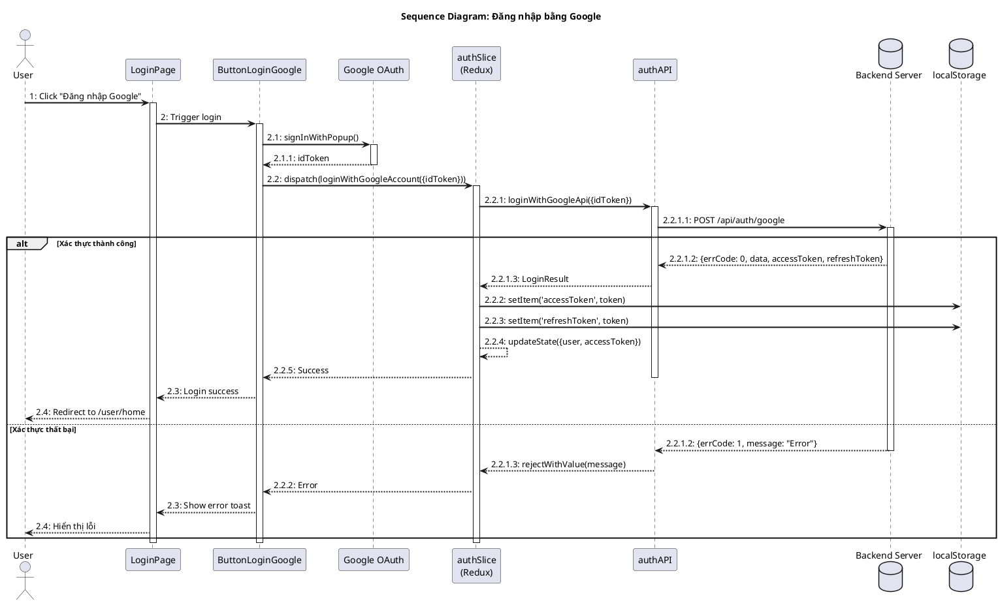

#### Bảng mô tả Sequence Diagram: Đăng nhập bằng Google

| Bước    | Nội dung message                 | Mô tả                                              |
| ------- | -------------------------------- | -------------------------------------------------- |
| 1       | Click "Đăng nhập Google"         | User click vào nút đăng nhập Google trên giao diện |
| 2       | Trigger login                    | LoginPage kích hoạt component ButtonLoginGoogle    |
| 2.1     | signInWithPopup()                | Gọi Google OAuth để hiển thị popup đăng nhập       |
| 2.1.1   | idToken                          | Google trả về idToken sau khi xác thực thành công  |
| 2.2     | dispatch(loginWithGoogleAccount) | Dispatch action Redux với idToken                  |
| 2.2.1   | loginWithGoogleApi({idToken})    | Gọi API service để gửi request                     |
| 2.2.1.1 | POST /api/auth/google            | Gửi request HTTP đến Backend Server                |
| 2.2.1.2 | {errCode, data, tokens}          | Server trả về kết quả xác thực                     |
| 2.2.1.3 | LoginResult / rejectWithValue    | API trả kết quả cho Redux thunk                    |
| 2.2.2   | setItem('accessToken')           | Lưu accessToken vào localStorage                   |
| 2.2.3   | setItem('refreshToken')          | Lưu refreshToken vào localStorage                  |
| 2.2.4   | updateState({user, accessToken}) | Cập nhật Redux state với thông tin user            |
| 2.2.5   | Success                          | Thông báo thành công cho component                 |
| 2.3     | Login success                    | ButtonLoginGoogle thông báo cho LoginPage          |
| 2.4     | Redirect to /user/home           | Chuyển hướng user đến trang chủ                    |

### 2. Đăng nhập bằng Email/Password

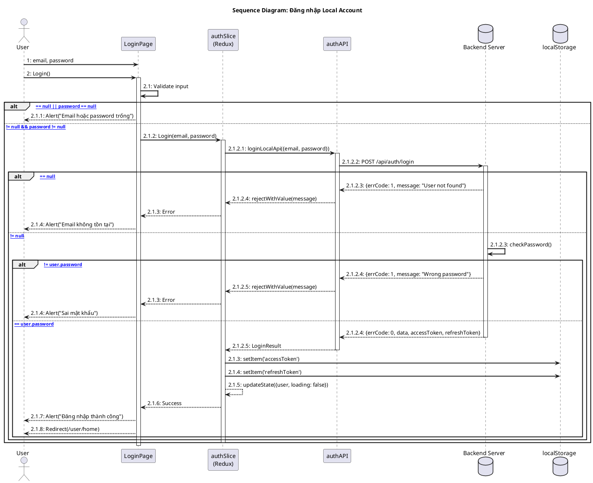

#### Bảng mô tả Sequence Diagram: Đăng nhập bằng Email/Password

| Bước    | Nội dung message                   | Mô tả                                                      |
| ------- | ---------------------------------- | ---------------------------------------------------------- |
| 1       | email, password                    | User nhập email và password vào form đăng nhập             |
| 2       | Login()                            | Hàm yêu cầu đăng nhập, không tham số, không có kiểu trả về |
| 2.1     | Validate input                     | Hàm kiểm tra email và password có hợp lệ không             |
| 2.1.1   | Alert("Email hoặc password trống") | Thông báo email hoặc password bị null                      |
| 2.1.2   | Login(email, password)             | Hàm xử lý đăng nhập, tham số là email và password          |
| 2.1.2.1 | loginLocalApi({email, password})   | Gọi API đăng nhập với email và password                    |
| 2.1.2.2 | POST /api/auth/login               | Gửi request HTTP đến Backend Server                        |
| 2.1.2.3 | checkPassword() / Response         | Kiểm tra mật khẩu hoặc trả về response                     |
| 2.1.2.4 | LoginResult / rejectWithValue      | API trả kết quả cho Redux thunk                            |
| 2.1.3   | setItem('accessToken') / Error     | Lưu token hoặc báo lỗi                                     |
| 2.1.4   | setItem('refreshToken') / Alert    | Lưu refresh token hoặc hiện thông báo                      |
| 2.1.5   | updateState({user})                | Cập nhật Redux state với thông tin user                    |
| 2.1.6   | Success                            | Thông báo thành công cho component                         |
| 2.1.7   | Alert("Đăng nhập thành công")      | Hiển thị thông báo đăng nhập thành công                    |
| 2.1.8   | Redirect(/user/home)               | Chuyển hướng đến trang chủ user                            |

### 3. Đăng ký tài khoản

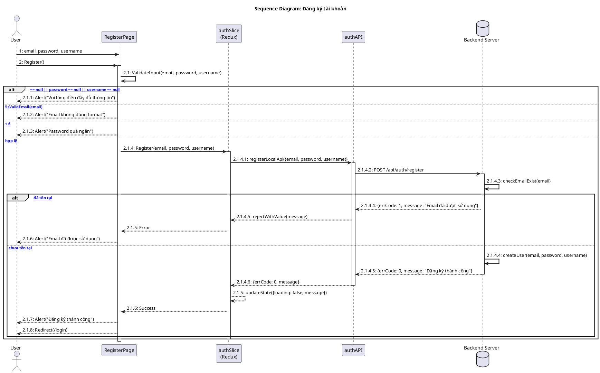

#### Bảng mô tả Sequence Diagram: Đăng ký tài khoản

| Bước    | Nội dung message                         | Mô tả                                                    |
| ------- | ---------------------------------------- | -------------------------------------------------------- |
| 1       | email, password, username                | User nhập thông tin đăng ký vào form                     |
| 2       | Register()                               | Hàm yêu cầu đăng ký, không tham số, không có kiểu trả về |
| 2.1     | ValidateInput(email, password, username) | Hàm kiểm tra dữ liệu nhập vào có hợp lệ không            |
| 2.1.1   | Alert("Vui lòng điền đầy đủ thông tin")  | Thông báo khi có trường bị trống                         |
| 2.1.2   | Alert("Email không đúng format")         | Thông báo email không đúng định dạng                     |
| 2.1.3   | Alert("Password quá ngắn")               | Thông báo password ít hơn 6 ký tự                        |
| 2.1.4   | Register(email, password, username)      | Hàm xử lý đăng ký với các tham số                        |
| 2.1.4.1 | registerLocalApi({...})                  | Gọi API đăng ký với thông tin user                       |
| 2.1.4.2 | POST /api/auth/register                  | Gửi request HTTP đến Backend Server                      |
| 2.1.4.3 | checkEmailExist(email)                   | Kiểm tra email đã tồn tại trong database chưa            |
| 2.1.4.4 | createUser() / Response                  | Tạo user mới hoặc trả về lỗi                             |
| 2.1.4.5 | {errCode, message}                       | Server trả về kết quả đăng ký                            |
| 2.1.4.6 | rejectWithValue / Result                 | API trả kết quả cho Redux thunk                          |
| 2.1.5   | updateState() / Error                    | Cập nhật state hoặc báo lỗi                              |
| 2.1.6   | Success / Alert                          | Thông báo kết quả cho component                          |
| 2.1.7   | Alert("Đăng ký thành công")              | Hiển thị thông báo đăng ký thành công                    |
| 2.1.8   | Redirect(/login)                         | Chuyển hướng đến trang đăng nhập                         |

### 4. Refresh Token

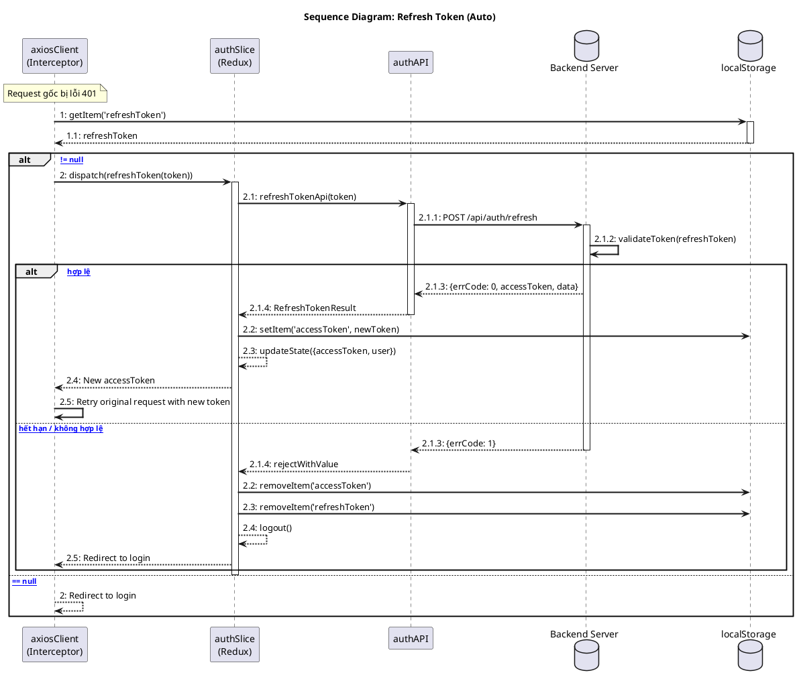

#### Bảng mô tả Sequence Diagram: Refresh Token

| Bước  | Nội dung message                           | Mô tả                                        |
| ----- | ------------------------------------------ | -------------------------------------------- |
| 1     | getItem('refreshToken')                    | Lấy refreshToken từ localStorage             |
| 1.1   | refreshToken                               | localStorage trả về giá trị refreshToken     |
| 2     | dispatch(refreshToken(token))              | Dispatch action để refresh token             |
| 2.1   | refreshTokenApi(token)                     | Gọi API service với refreshToken             |
| 2.1.1 | POST /api/auth/refresh                     | Gửi request HTTP đến Backend Server          |
| 2.1.2 | validateToken(refreshToken)                | Server xác thực refreshToken có hợp lệ không |
| 2.1.3 | {errCode, accessToken} / {errCode: 1}      | Server trả về accessToken mới hoặc lỗi       |
| 2.1.4 | RefreshTokenResult / rejectWithValue       | API trả kết quả cho Redux thunk              |
| 2.2   | setItem('accessToken') / removeItem()      | Lưu token mới hoặc xóa tokens                |
| 2.3   | updateState() / removeItem('refreshToken') | Cập nhật state hoặc xóa refreshToken         |
| 2.4   | logout() / New accessToken                 | Đăng xuất hoặc trả về token mới              |
| 2.5   | Retry request / Redirect to login          | Thử lại request hoặc chuyển đến trang login  |

---

## Create Lesson

### Tạo bài học mới (Manual + AI)

**Mô tả luồng:**

1. User nhập thông tin bài học (title, description)
2. User có thể thêm thẻ thủ công hoặc dùng AI generate
3. Submit tạo bài học
4. Gọi API tạo file
5. Redirect đến trang bài học mới

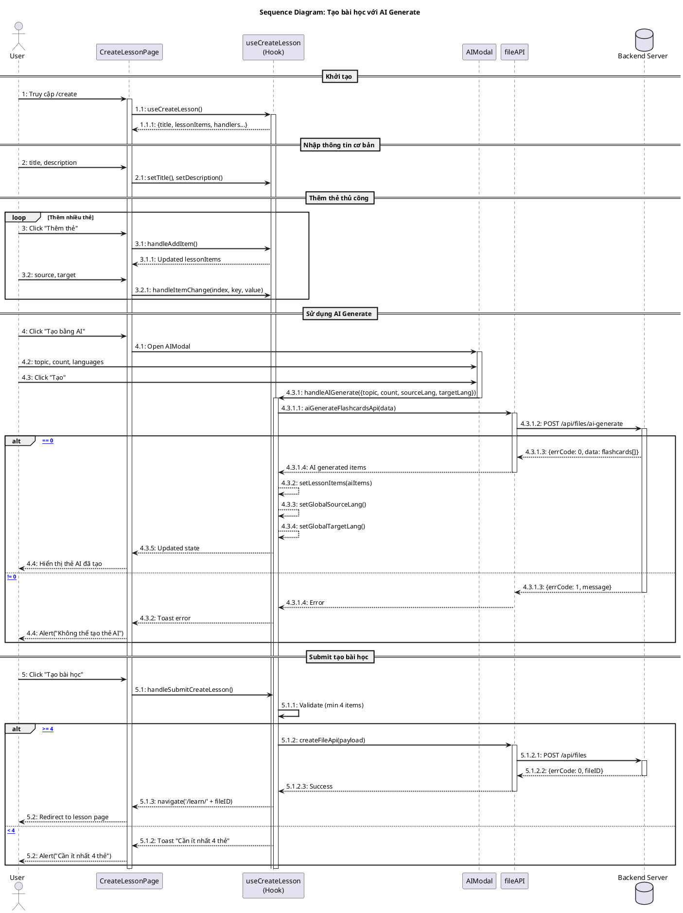

#### Bảng mô tả Sequence Diagram: Tạo bài học

| Bước    | Nội dung message                    | Mô tả                                      |
| ------- | ----------------------------------- | ------------------------------------------ |
| 1       | Truy cập /create                    | User mở trang tạo bài học                  |
| 1.1     | useCreateLesson()                   | Khởi tạo hook quản lý state tạo bài học    |
| 1.1.1   | {title, lessonItems, handlers}      | Hook trả về state và các handler           |
| 2       | title, description                  | User nhập tiêu đề và mô tả bài học         |
| 2.1     | setTitle(), setDescription()        | Cập nhật state title và description        |
| 3       | Click "Thêm thẻ"                    | User thêm thẻ mới thủ công                 |
| 3.1     | handleAddItem()                     | Thêm một item rỗng vào danh sách           |
| 3.1.1   | Updated lessonItems                 | Trả về danh sách đã cập nhật               |
| 3.2     | source, target                      | User nhập nội dung thẻ (từ nguồn, từ đích) |
| 3.2.1   | handleItemChange(index, key, value) | Cập nhật nội dung thẻ tại index            |
| 4       | Click "Tạo bằng AI"                 | User mở modal AI generate                  |
| 4.1     | Open AIModal                        | Mở modal nhập thông tin AI                 |
| 4.2     | topic, count, languages             | User nhập chủ đề, số lượng, ngôn ngữ       |
| 4.3     | Click "Tạo"                         | User submit yêu cầu AI generate            |
| 4.3.1   | handleAIGenerate({...})             | Gọi handler xử lý AI generate              |
| 4.3.1.1 | aiGenerateFlashcardsApi(data)       | Gọi API service AI                         |
| 4.3.1.2 | POST /api/files/ai-generate         | Gửi request đến server AI                  |
| 4.3.1.3 | {errCode, data}                     | Server trả về kết quả generate             |
| 4.3.1.4 | AI generated items / Error          | API trả kết quả cho hook                   |
| 4.3.2-4 | setLessonItems, setLang             | Cập nhật state với dữ liệu AI              |
| 5       | Click "Tạo bài học"                 | User submit tạo bài học                    |
| 5.1     | handleSubmitCreateLesson()          | Gọi handler submit                         |
| 5.1.1   | Validate                            | Kiểm tra số lượng thẻ >= 4                 |
| 5.1.2   | createFileApi(payload)              | Gọi API tạo file                           |
| 5.1.2.1 | POST /api/files                     | Gửi request tạo file                       |
| 5.1.2.2 | {errCode, fileID}                   | Server trả về fileID mới                   |
| 5.1.3   | navigate('/learn/' + fileID)        | Chuyển hướng đến trang bài học             |

---

## Flashcard

### Học thẻ ghi nhớ

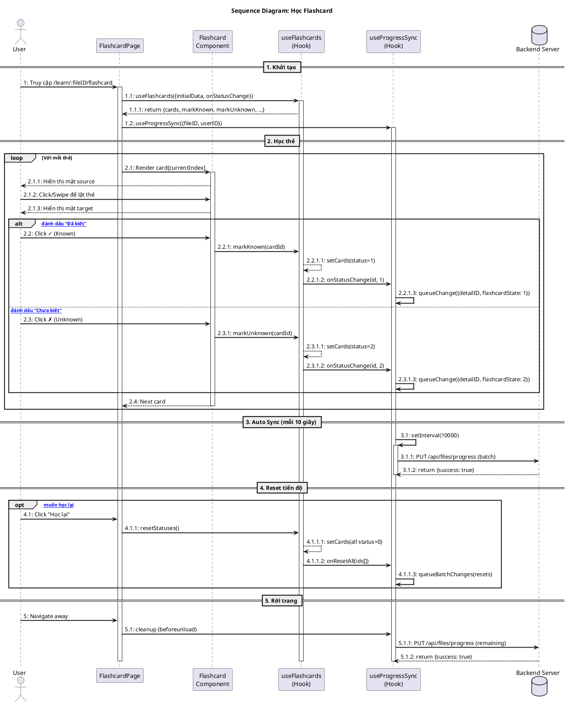

#### Bảng mô tả Sequence Diagram: Học Flashcard

| Bước    | Nội dung message                             | Mô tả                                    |
| ------- | -------------------------------------------- | ---------------------------------------- |
| 1       | Truy cập /learn/:fileID/flashcard            | User mở trang học flashcard              |
| 1.1     | useFlashcards({initialData, onStatusChange}) | Page gọi hook khởi tạo flashcard         |
| 1.1.1   | return {cards, markKnown, markUnknown, ...}  | Hook trả về state và handlers            |
| 1.2     | useProgressSync({fileID, userID})            | Khởi tạo hook đồng bộ tiến độ            |
| 2.1     | Render card[currentIndex]                    | Page render thẻ hiện tại                 |
| 2.1.1   | Hiển thị mặt source                          | Hiển thị mặt trước (từ gốc)              |
| 2.1.2   | Click/Swipe để lật thẻ                       | User tương tác lật thẻ                   |
| 2.1.3   | Hiển thị mặt target                          | Hiển thị mặt sau (nghĩa)                 |
| 2.2     | Click ✓ (Known)                              | User đánh dấu đã biết thẻ này            |
| 2.2.1   | markKnown(cardId)                            | Component gọi handler đánh dấu biết      |
| 2.2.1.1 | setCards(status=1)                           | Hook cập nhật status = 1 (Known)         |
| 2.2.1.2 | onStatusChange(id, 1)                        | Hook thông báo Sync về thay đổi          |
| 2.2.1.3 | queueChange({detailID, flashcardState: 1})   | Sync thêm vào queue đồng bộ              |
| 2.3     | Click ✗ (Unknown)                            | User đánh dấu chưa biết thẻ này          |
| 2.3.1   | markUnknown(cardId)                          | Component gọi handler đánh dấu chưa biết |
| 2.3.1.1 | setCards(status=2)                           | Hook cập nhật status = 2 (Unknown)       |
| 2.3.1.2 | onStatusChange(id, 2)                        | Hook thông báo Sync về thay đổi          |
| 2.3.1.3 | queueChange({detailID, flashcardState: 2})   | Sync thêm vào queue đồng bộ              |
| 2.4     | Next card                                    | Component thông báo chuyển thẻ tiếp theo |
| 3.1     | setInterval(10000)                           | Sync thiết lập auto sync mỗi 10 giây     |
| 3.1.1   | PUT /api/files/progress (batch)              | Sync gửi batch tiến độ lên server        |
| 3.1.2   | return {success: true}                       | Server xác nhận đồng bộ thành công       |
| 4.1     | Click "Học lại"                              | User muốn reset tiến độ học              |
| 4.1.1   | resetStatuses()                              | Page gọi hàm reset                       |
| 4.1.1.1 | setCards(all status=0)                       | Hook đặt tất cả thẻ về status = 0        |
| 4.1.1.2 | onResetAll(ids[])                            | Hook thông báo reset tất cả              |
| 4.1.1.3 | queueBatchChanges(resets)                    | Sync queue batch changes để đồng bộ      |
| 5       | Navigate away                                | User rời khỏi trang flashcard            |
| 5.1     | cleanup (beforeunload)                       | Page trigger cleanup khi rời trang       |
| 5.1.1   | PUT /api/files/progress (remaining)          | Sync gửi các thay đổi còn lại            |
| 5.1.2   | return {success: true}                       | Server xác nhận thành công               |

---

## Test Exam

### Làm bài kiểm tra

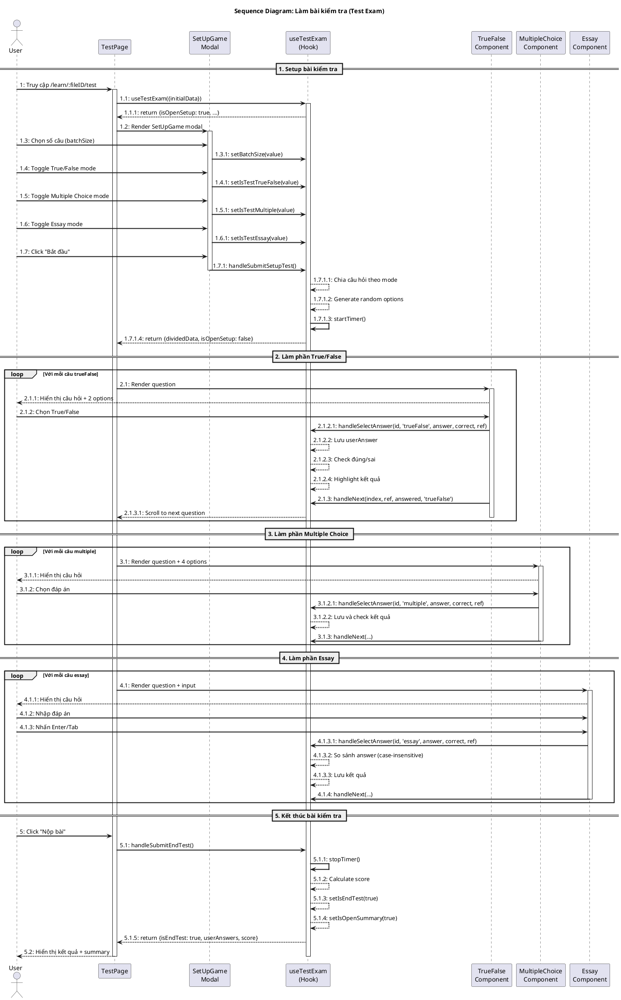

#### Bảng mô tả Sequence Diagram: Làm bài kiểm tra

| Bước    | Nội dung message                                          | Mô tả                                     |
| ------- | --------------------------------------------------------- | ----------------------------------------- |
| 1       | Truy cập /learn/:fileID/test                              | User mở trang bài kiểm tra                |
| 1.1     | useTestExam({initialData})                                | Page gọi hook khởi tạo test               |
| 1.1.1   | return {isOpenSetup: true, ...}                           | Hook trả về state setup ban đầu           |
| 1.2     | Render SetUpGame modal                                    | Page hiển thị modal cài đặt bài test      |
| 1.3     | Chọn số câu (batchSize)                                   | User chọn số lượng câu hỏi                |
| 1.3.1   | setBatchSize(value)                                       | Hook cập nhật số câu hỏi                  |
| 1.4     | Toggle True/False mode                                    | User bật/tắt chế độ Đúng/Sai              |
| 1.4.1   | setIsTestTrueFalse(value)                                 | Hook cập nhật mode True/False             |
| 1.5     | Toggle Multiple Choice mode                               | User bật/tắt chế độ Trắc nghiệm           |
| 1.5.1   | setIsTestMultiple(value)                                  | Hook cập nhật mode Multiple Choice        |
| 1.6     | Toggle Essay mode                                         | User bật/tắt chế độ Tự luận               |
| 1.6.1   | setIsTestEssay(value)                                     | Hook cập nhật mode Essay                  |
| 1.7     | Click "Bắt đầu"                                           | User bắt đầu bài kiểm tra                 |
| 1.7.1   | handleSubmitSetupTest()                                   | Hook xử lý setup và bắt đầu               |
| 1.7.1.1 | Chia câu hỏi theo mode                                    | Phân chia câu hỏi theo từng loại          |
| 1.7.1.2 | Generate random options                                   | Tạo các đáp án ngẫu nhiên                 |
| 1.7.1.3 | startTimer()                                              | Bắt đầu đếm thời gian                     |
| 1.7.1.4 | return {dividedData, isOpenSetup: false}                  | Trả về dữ liệu đã chia và đóng setup      |
| 2.1     | Render question                                           | Page render câu hỏi True/False            |
| 2.1.1   | Hiển thị câu hỏi + 2 options                              | Component hiển thị câu hỏi với 2 lựa chọn |
| 2.1.2   | Chọn True/False                                           | User chọn đáp án Đúng hoặc Sai            |
| 2.1.2.1 | handleSelectAnswer(id, 'trueFalse', answer, correct, ref) | Hook xử lý đáp án đã chọn                 |
| 2.1.2.2 | Lưu userAnswer                                            | Lưu câu trả lời của user                  |
| 2.1.2.3 | Check đúng/sai                                            | So sánh với đáp án đúng                   |
| 2.1.2.4 | Highlight kết quả                                         | Hiển thị màu đúng/sai                     |
| 2.1.3   | handleNext(index, ref, answered, 'trueFalse')             | Xử lý chuyển câu tiếp theo                |
| 2.1.3.1 | Scroll to next question                                   | Cuộn đến câu hỏi tiếp theo                |
| 3.1     | Render question + 4 options                               | Page render câu trắc nghiệm với 4 đáp án  |
| 3.1.1   | Hiển thị câu hỏi                                          | Component hiển thị nội dung câu hỏi       |
| 3.1.2   | Chọn đáp án                                               | User chọn 1 trong 4 đáp án                |
| 3.1.2.1 | handleSelectAnswer(id, 'multiple', answer, correct, ref)  | Hook xử lý đáp án trắc nghiệm             |
| 3.1.2.2 | Lưu và check kết quả                                      | Lưu và kiểm tra kết quả                   |
| 3.1.3   | handleNext(...)                                           | Chuyển câu hỏi tiếp theo                  |
| 4.1     | Render question + input                                   | Page render câu tự luận với ô nhập        |
| 4.1.1   | Hiển thị câu hỏi                                          | Component hiển thị câu hỏi tự luận        |
| 4.1.2   | Nhập đáp án                                               | User nhập câu trả lời                     |
| 4.1.3   | Nhấn Enter/Tab                                            | User xác nhận đáp án                      |
| 4.1.3.1 | handleSelectAnswer(id, 'essay', answer, correct, ref)     | Hook xử lý đáp án tự luận                 |
| 4.1.3.2 | So sánh answer (case-insensitive)                         | So sánh không phân biệt hoa thường        |
| 4.1.3.3 | Lưu kết quả                                               | Lưu kết quả câu trả lời                   |
| 4.1.4   | handleNext(...)                                           | Chuyển câu hỏi tiếp theo                  |
| 5       | Click "Nộp bài"                                           | User nộp bài kiểm tra                     |
| 5.1     | handleSubmitEndTest()                                     | Hook xử lý kết thúc bài test              |
| 5.1.1   | stopTimer()                                               | Dừng đồng hồ đếm giờ                      |
| 5.1.2   | Calculate score                                           | Tính điểm bài kiểm tra                    |
| 5.1.3   | setIsEndTest(true)                                        | Đánh dấu đã kết thúc test                 |
| 5.1.4   | setIsOpenSummary(true)                                    | Mở modal tổng kết                         |
| 5.1.5   | return {isEndTest: true, userAnswers, score}              | Trả về kết quả bài test                   |
| 5.2     | Hiển thị kết quả + summary                                | Hiển thị điểm số và tổng kết chi tiết     |

---

## Blocks Game

### Trò chơi xếp khối

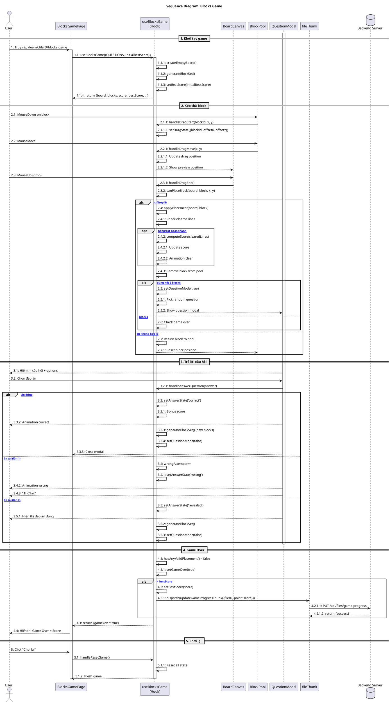

#### Bảng mô tả Sequence Diagram: Blocks Game

| Bước    | Nội dung message                                          | Mô tả                                   |
| ------- | --------------------------------------------------------- | --------------------------------------- |
| 1       | Truy cập /learn/:fileID/blocks-game                       | User mở trang trò chơi Blocks Game      |
| 1.1     | useBlocksGame({QUESTIONS, initialBestScore})              | Page gọi hook khởi tạo game             |
| 1.1.1   | createEmptyBoard()                                        | Tạo board trống 10x10                   |
| 1.1.2   | generateBlockSet()                                        | Tạo set 3 blocks ngẫu nhiên             |
| 1.1.3   | setBestScore(initialBestScore)                            | Lấy điểm cao nhất từ dữ liệu đã load    |
| 1.1.4   | return {board, blocks, score, bestScore, ...}             | Hook trả về state và handlers           |
| 2.1     | MouseDown on block                                        | User bắt đầu kéo block                  |
| 2.1.1   | handleDragStart(blockId, x, y)                            | Pool thông báo bắt đầu kéo              |
| 2.1.1.1 | setDragState({blockId, offsetX, offsetY})                 | Lưu state kéo thả                       |
| 2.2     | MouseMove                                                 | User di chuyển block                    |
| 2.2.1   | handleDragMove(x, y)                                      | Pool cập nhật vị trí kéo                |
| 2.2.1.1 | Update drag position                                      | Cập nhật vị trí hiện tại                |
| 2.2.1.2 | Show preview position                                     | Hiển thị preview trên board             |
| 2.3     | MouseUp (drop)                                            | User thả block                          |
| 2.3.1   | handleDragEnd()                                           | Board thông báo kết thúc kéo            |
| 2.3.2   | canPlaceBlock(board, block, x, y)                         | Kiểm tra vị trí có hợp lệ               |
| 2.4     | applyPlacement(board, block)                              | Đặt block vào board (nếu hợp lệ)        |
| 2.4.1   | Check cleared lines                                       | Kiểm tra hàng/cột hoàn thành            |
| 2.4.2   | computeScore(clearedLines)                                | Tính điểm từ các hàng xóa               |
| 2.4.2.1 | Update score                                              | Cập nhật điểm số                        |
| 2.4.2.2 | Animation clear                                           | Hiệu ứng xóa hàng/cột                   |
| 2.4.3   | Remove block from pool                                    | Xóa block đã dùng khỏi pool             |
| 2.5     | setQuestionMode(true)                                     | Bật chế độ trả lời câu hỏi              |
| 2.5.1   | Pick random question                                      | Chọn câu hỏi ngẫu nhiên                 |
| 2.5.2   | Show question modal                                       | Hiển thị modal câu hỏi                  |
| 2.6     | Check game over                                           | Kiểm tra game over (nếu còn blocks)     |
| 2.7     | Return block to pool                                      | Trả block về pool (vị trí không hợp lệ) |
| 2.7.1   | Reset block position                                      | Reset vị trí block                      |
| 3.1     | Hiển thị câu hỏi + options                                | Modal hiển thị câu hỏi và các đáp án    |
| 3.2     | Chọn đáp án                                               | User chọn đáp án                        |
| 3.2.1   | handleAnswerQuestion(answer)                              | Modal gửi đáp án đến hook               |
| 3.3     | setAnswerState('correct')                                 | Đánh dấu trả lời đúng                   |
| 3.3.1   | Bonus score                                               | Cộng điểm thưởng                        |
| 3.3.2   | Animation correct                                         | Hiệu ứng trả lời đúng                   |
| 3.3.3   | generateBlockSet() (new blocks)                           | Tạo set blocks mới                      |
| 3.3.4   | setQuestionMode(false)                                    | Tắt chế độ câu hỏi                      |
| 3.3.5   | Close modal                                               | Đóng modal câu hỏi                      |
| 3.4     | wrongAttempts++                                           | Tăng số lần sai (trả lời sai lần 1)     |
| 3.4.1   | setAnswerState('wrong')                                   | Đánh dấu trả lời sai                    |
| 3.4.2   | Animation wrong                                           | Hiệu ứng trả lời sai                    |
| 3.4.3   | "Thử lại!"                                                | Thông báo cho user thử lại              |
| 3.5     | setAnswerState('revealed')                                | Đánh dấu đã hiển thị đáp án (sai lần 2) |
| 3.5.1   | Hiển thị đáp án đúng                                      | Hiện đáp án đúng cho user               |
| 3.5.2   | generateBlockSet()                                        | Tạo set blocks mới                      |
| 3.5.3   | setQuestionMode(false)                                    | Tắt chế độ câu hỏi                      |
| 4.1     | hasAnyValidPlacement() = false                            | Không còn vị trí hợp lệ nào             |
| 4.1.1   | setGameOver(true)                                         | Đánh dấu game over                      |
| 4.2     | setBestScore(score)                                       | Cập nhật điểm cao nhất (nếu vượt)       |
| 4.2.1   | dispatch(updateGameProgressThunk({fileID, point: score})) | Dispatch thunk lưu điểm cao             |
| 4.2.1.1 | PUT /api/files/game-progress                              | Gửi request cập nhật điểm lên server    |
| 4.2.1.2 | return {success}                                          | Server xác nhận lưu thành công          |
| 4.3     | return {gameOver: true}                                   | Hook trả về state game over             |
| 4.4     | Hiển thị Game Over + Score                                | Page hiển thị màn hình kết thúc         |
| 5       | Click "Chơi lại"                                          | User muốn chơi lại                      |
| 5.1     | handleResetGame()                                         | Page gọi handler reset                  |
| 5.1.1   | Reset all state                                           | Hook reset toàn bộ state                |
| 5.1.2   | Fresh game                                                | Bắt đầu game mới                        |

---

## Card Matching

### Trò chơi ghép cặp thẻ

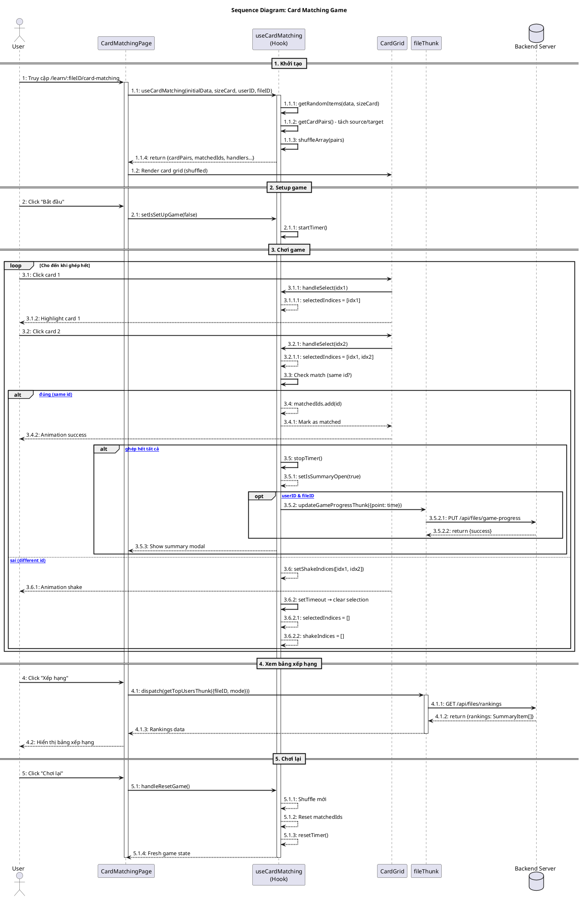

#### Bảng mô tả Sequence Diagram: Card Matching Game

| Bước    | Nội dung message                                       | Mô tả                                    |
| ------- | ------------------------------------------------------ | ---------------------------------------- |
| 1       | Truy cập /learn/:fileID/card-matching                  | User mở trang trò chơi ghép thẻ          |
| 1.1     | useCardMatching(initialData, sizeCard, userID, fileID) | Page gọi hook khởi tạo game              |
| 1.1.1   | getRandomItems(data, sizeCard)                         | Chọn ngẫu nhiên số thẻ theo sizeCard     |
| 1.1.2   | getCardPairs() - tách source/target                    | Tách thành cặp thẻ source và target      |
| 1.1.3   | shuffleArray(pairs)                                    | Xáo trộn các thẻ                         |
| 1.1.4   | return {cardPairs, matchedIds, handlers...}            | Hook trả về state và handlers            |
| 1.2     | Render card grid (shuffled)                            | Page render lưới thẻ đã xáo              |
| 2       | Click "Bắt đầu"                                        | User bắt đầu chơi game                   |
| 2.1     | setIsSetUpGame(false)                                  | Tắt chế độ setup                         |
| 2.1.1   | startTimer()                                           | Bắt đầu đếm thời gian                    |
| 3.1     | Click card 1                                           | User chọn thẻ đầu tiên                   |
| 3.1.1   | handleSelect(idx1)                                     | Grid thông báo thẻ được chọn             |
| 3.1.1.1 | selectedIndices = [idx1]                               | Lưu index thẻ đầu tiên                   |
| 3.1.2   | Highlight card 1                                       | Highlight thẻ đã chọn                    |
| 3.2     | Click card 2                                           | User chọn thẻ thứ hai                    |
| 3.2.1   | handleSelect(idx2)                                     | Grid thông báo thẻ thứ hai               |
| 3.2.1.1 | selectedIndices = [idx1, idx2]                         | Lưu cả 2 index                           |
| 3.3     | Check match (same id?)                                 | Kiểm tra 2 thẻ có cùng id không          |
| 3.4     | matchedIds.add(id)                                     | Thêm id vào danh sách đã ghép (nếu đúng) |
| 3.4.1   | Mark as matched                                        | Đánh dấu thẻ đã ghép                     |
| 3.4.2   | Animation success                                      | Hiệu ứng ghép thành công                 |
| 3.5     | stopTimer()                                            | Dừng đồng hồ (ghép hết)                  |
| 3.5.1   | setIsSummaryOpen(true)                                 | Mở modal tổng kết                        |
| 3.5.2   | updateGameProgressThunk({point: time})                 | Gửi điểm lên server                      |
| 3.5.2.1 | PUT /api/files/game-progress                           | Request cập nhật tiến độ                 |
| 3.5.2.2 | return {success}                                       | Server xác nhận                          |
| 3.5.3   | Show summary modal                                     | Hiển thị modal kết quả                   |
| 3.6     | setShakeIndices([idx1, idx2])                          | Đánh dấu 2 thẻ sai để rung               |
| 3.6.1   | Animation shake                                        | Hiệu ứng rung (ghép sai)                 |
| 3.6.2   | setTimeout → clear selection                           | Đợi rồi xóa selection                    |
| 3.6.2.1 | selectedIndices = []                                   | Reset selected indices                   |
| 3.6.2.2 | shakeIndices = []                                      | Reset shake indices                      |
| 4       | Click "Xếp hạng"                                       | User muốn xem bảng xếp hạng              |
| 4.1     | dispatch(getTopUsersThunk({fileID, mode}))             | Gọi thunk lấy rankings                   |
| 4.1.1   | GET /api/files/rankings                                | Request lấy danh sách xếp hạng           |
| 4.1.2   | return {rankings: SummaryItem[]}                       | Server trả về rankings                   |
| 4.1.3   | Rankings data                                          | Truyền data về Page                      |
| 4.2     | Hiển thị bảng xếp hạng                                 | Page render bảng xếp hạng                |
| 5       | Click "Chơi lại"                                       | User muốn chơi lại                       |
| 5.1     | handleResetGame()                                      | Page gọi handler reset                   |
| 5.1.1   | Shuffle mới                                            | Xáo trộn lại thẻ                         |
| 5.1.2   | Reset matchedIds                                       | Reset danh sách đã ghép                  |
| 5.1.3   | resetTimer()                                           | Reset đồng hồ                            |
| 5.1.4   | Fresh game state                                       | Game state mới                           |

---

## Library Management

### Quản lý thư viện file

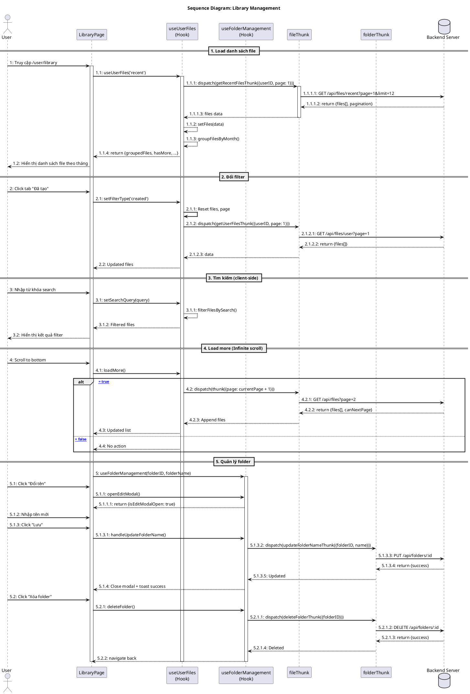

#### Bảng mô tả Sequence Diagram: Library Management

| Bước    | Nội dung message                                  | Mô tả                                       |
| ------- | ------------------------------------------------- | ------------------------------------------- |
| 1       | Truy cập /user/library                            | User mở trang thư viện                      |
| 1.1     | useUserFiles('recent')                            | Page gọi hook quản lý files                 |
| 1.1.1   | dispatch(getRecentFilesThunk({userID, page: 1}))  | Hook dispatch thunk lấy file gần đây        |
| 1.1.1.1 | GET /api/files/recent?page=1&limit=12             | Thunk gửi request đến server                |
| 1.1.1.2 | return {files[], pagination}                      | Server trả về danh sách files               |
| 1.1.1.3 | files data                                        | Thunk trả data về hook                      |
| 1.1.2   | setFiles(data)                                    | Hook lưu danh sách files vào state          |
| 1.1.3   | groupFilesByMonth()                               | Hook nhóm files theo tháng                  |
| 1.1.4   | return {groupedFiles, hasMore, ...}               | Hook trả về state đã xử lý                  |
| 1.2     | Hiển thị danh sách file theo tháng                | Page render danh sách files                 |
| 2       | Click tab "Đã tạo"                                | User đổi filter sang tab created            |
| 2.1     | setFilterType('created')                          | Page thay đổi loại filter                   |
| 2.1.1   | Reset files, page                                 | Hook reset state về ban đầu                 |
| 2.1.2   | dispatch(getUserFilesThunk({userID, page: 1}))    | Dispatch thunk lấy files do user tạo        |
| 2.1.2.1 | GET /api/files/user?page=1                        | Thunk gửi request                           |
| 2.1.2.2 | return {files[]}                                  | Server trả về files                         |
| 2.1.2.3 | data                                              | Thunk trả data về hook                      |
| 2.2     | Updated files                                     | Hook cập nhật files mới                     |
| 3       | Nhập từ khóa search                               | User nhập tìm kiếm                          |
| 3.1     | setSearchQuery(query)                             | Page cập nhật query tìm kiếm                |
| 3.1.1   | filterFilesBySearch()                             | Hook filter files theo query (client-side)  |
| 3.1.2   | Filtered files                                    | Hook trả về files đã filter                 |
| 3.2     | Hiển thị kết quả filter                           | Page render kết quả tìm kiếm                |
| 4       | Scroll to bottom                                  | User cuộn xuống cuối trang                  |
| 4.1     | loadMore()                                        | Page gọi hàm load thêm                      |
| 4.2     | dispatch(thunk({page: currentPage + 1}))          | Hook dispatch lấy trang tiếp theo           |
| 4.2.1   | GET /api/files?page=2                             | Thunk gửi request trang 2                   |
| 4.2.2   | return {files[], canNextPage}                     | Server trả về files và thông tin phân trang |
| 4.2.3   | Append files                                      | Thunk append vào danh sách hiện tại         |
| 4.3     | Updated list                                      | Hook cập nhật list mới                      |
| 4.4     | No action                                         | Không làm gì nếu hết dữ liệu                |
| 5       | useFolderManagement(folderID, folderName)         | Khởi tạo hook quản lý folder                |
| 5.1     | Click "Đổi tên"                                   | User muốn đổi tên folder                    |
| 5.1.1   | openEditModal()                                   | Mở modal edit                               |
| 5.1.1.1 | return {isEditModalOpen: true}                    | Hook trả về state modal                     |
| 5.1.2   | Nhập tên mới                                      | User nhập tên folder mới                    |
| 5.1.3   | Click "Lưu"                                       | User xác nhận lưu                           |
| 5.1.3.1 | handleUpdateFolderName()                          | Page gọi handler update                     |
| 5.1.3.2 | dispatch(updateFolderNameThunk({folderID, name})) | Hook dispatch thunk update                  |
| 5.1.3.3 | PUT /api/folders/:id                              | Thunk gửi request update                    |
| 5.1.3.4 | return {success}                                  | Server xác nhận thành công                  |
| 5.1.3.5 | Updated                                           | Thunk thông báo cập nhật                    |
| 5.1.4   | Close modal + toast success                       | Hook đóng modal và hiện thông báo           |
| 5.2     | Click "Xóa folder"                                | User muốn xóa folder                        |
| 5.2.1   | deleteFolder()                                    | Page gọi handler xóa                        |
| 5.2.1.1 | dispatch(deleteFolderThunk({folderID}))           | Hook dispatch thunk xóa                     |
| 5.2.1.2 | DELETE /api/folders/:id                           | Thunk gửi request xóa                       |
| 5.2.1.3 | return {success}                                  | Server xác nhận xóa thành công              |
| 5.2.1.4 | Deleted                                           | Thunk thông báo đã xóa                      |
| 5.2.2   | navigate back                                     | Hook chuyển hướng về trang trước            |

---

## Progress Sync

### Đồng bộ tiến độ học tập

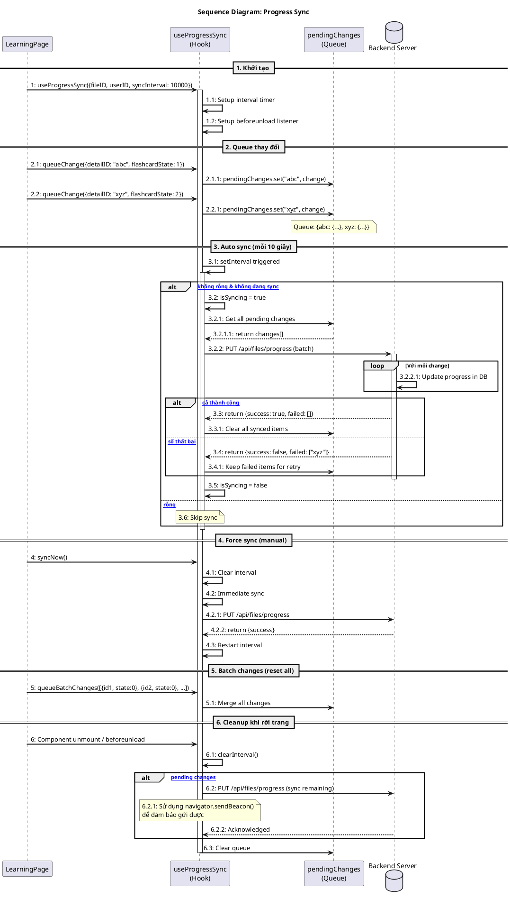

#### Bảng mô tả Sequence Diagram: Progress Sync

| Bước    | Nội dung message                                         | Mô tả                                    |
| ------- | -------------------------------------------------------- | ---------------------------------------- |
| 1       | useProgressSync({fileID, userID, syncInterval: 10000})   | Page khởi tạo hook đồng bộ tiến độ       |
| 1.1     | Setup interval timer                                     | Thiết lập interval sync mỗi 10 giây      |
| 1.2     | Setup beforeunload listener                              | Thiết lập listener khi rời trang         |
| 2.1     | queueChange({detailID: "abc", flashcardState: 1})        | Page thêm thay đổi vào queue             |
| 2.1.1   | pendingChanges.set("abc", change)                        | Hook lưu change vào queue                |
| 2.2     | queueChange({detailID: "xyz", flashcardState: 2})        | Page thêm thay đổi khác                  |
| 2.2.1   | pendingChanges.set("xyz", change)                        | Hook lưu change vào queue                |
| 3.1     | setInterval triggered                                    | Interval timer được trigger              |
| 3.2     | isSyncing = true                                         | Đánh dấu đang sync                       |
| 3.2.1   | Get all pending changes                                  | Lấy tất cả changes chờ sync              |
| 3.2.1.1 | return changes[]                                         | Queue trả về danh sách changes           |
| 3.2.2   | PUT /api/files/progress (batch)                          | Gửi batch request lên server             |
| 3.2.2.1 | Update progress in DB                                    | Server cập nhật từng change vào DB       |
| 3.3     | return {success: true, failed: []}                       | Server phản hồi thành công (tất cả)      |
| 3.3.1   | Clear all synced items                                   | Xóa các items đã sync khỏi queue         |
| 3.4     | return {success: false, failed: ["xyz"]}                 | Server phản hồi có lỗi (một số thất bại) |
| 3.4.1   | Keep failed items for retry                              | Giữ lại items thất bại để retry          |
| 3.5     | isSyncing = false                                        | Đánh dấu hoàn tất sync                   |
| 3.6     | Skip sync                                                | Bỏ qua sync nếu queue rỗng               |
| 4       | syncNow()                                                | Page gọi sync ngay lập tức               |
| 4.1     | Clear interval                                           | Xóa interval hiện tại                    |
| 4.2     | Immediate sync                                           | Thực hiện sync ngay                      |
| 4.2.1   | PUT /api/files/progress                                  | Gửi request sync                         |
| 4.2.2   | return {success}                                         | Server xác nhận                          |
| 4.3     | Restart interval                                         | Khởi động lại interval                   |
| 5       | queueBatchChanges([{id1, state:0}, {id2, state:0}, ...]) | Page queue nhiều changes cùng lúc        |
| 5.1     | Merge all changes                                        | Hook merge tất cả vào queue              |
| 6       | Component unmount / beforeunload                         | Component unmount hoặc user rời trang    |
| 6.1     | clearInterval()                                          | Xóa interval timer                       |
| 6.2     | PUT /api/files/progress (sync remaining)                 | Gửi các changes còn lại (nếu có)         |
| 6.2.1   | Sử dụng navigator.sendBeacon()                           | Dùng sendBeacon đảm bảo gửi được         |
| 6.2.2   | Acknowledged                                             | Server xác nhận nhận được                |
| 6.3     | Clear queue                                              | Xóa queue sau khi cleanup                |

---

## 📝 Hướng dẫn vẽ Sequence Diagram

### Bước 1: Xác định Use Case

- Liệt kê các chức năng chính
- Xác định actor (người dùng, hệ thống)
- Xác định các bước trong luồng

### Bước 2: Xác định Participants

```plantuml
' Các loại participant phổ biến
actor User                    ' Người dùng
participant "Component" as C  ' React Component
participant "Hook" as H       ' Custom Hook
participant "Redux" as R      ' Redux slice/thunk
participant "API" as A        ' API service
database "Server" as S        ' Backend server
database "Storage" as ST      ' localStorage/sessionStorage
```

### Bước 3: Vẽ Messages theo thứ tự thời gian

```plantuml
' Message types
A -> B: Synchronous call     ' Mũi tên đặc (đợi response)
A --> B: Response            ' Mũi tên đứt (trả về)
A ->> B: Async call          ' Bất đồng bộ
A -->> B: Async response
```

### Bước 4: Thêm các khối điều kiện

```plantuml
alt Success case
  A -> B: Action 1
else Failure case
  A -> B: Action 2
end

opt Optional action
  A -> B: Maybe do this
end

loop N times
  A -> B: Repeat
end
```

### Bước 5: Thêm notes và activation

```plantuml
activate A           ' Bắt đầu lifeline
note over A: Comment
note right of A: Side note
deactivate A         ' Kết thúc lifeline
```

---

## 🛠️ Tools để render PlantUML

1. **VS Code Extensions:**
   - PlantUML extension
   - Markdown Preview Enhanced

2. **Online Tools:**
   - [PlantUML Web Server](http://www.plantuml.com/plantuml)
   - [PlantText](https://www.planttext.com/)

3. **Integration:**
   - GitHub: Sử dụng với proxy URL
   - GitLab: Native support
   - Confluence: PlantUML plugin

---

**Tài liệu này cập nhật lần cuối**: 07/01/2026
